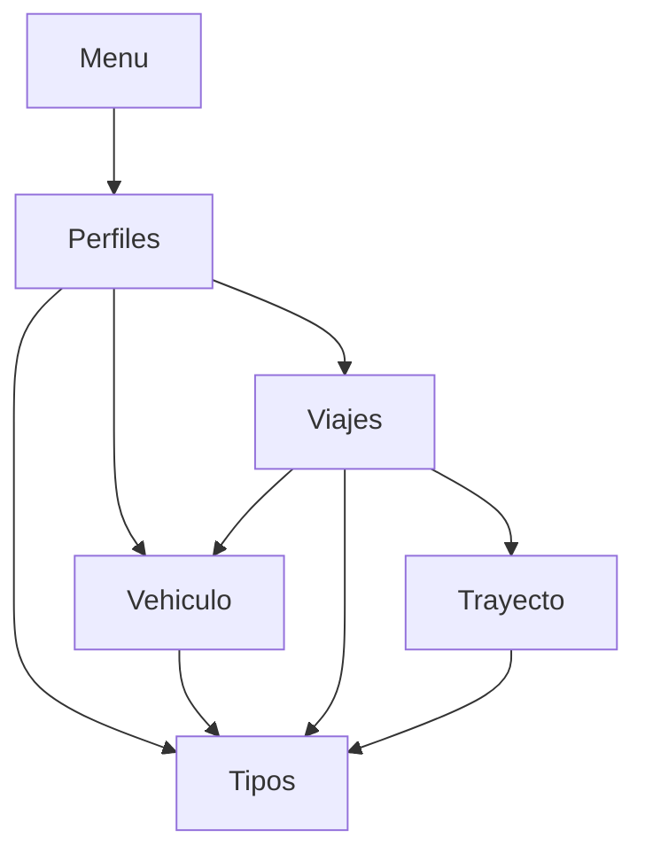
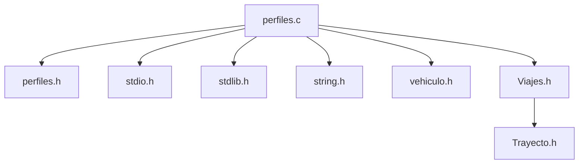
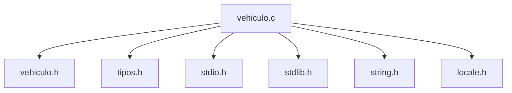
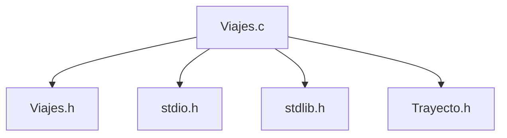
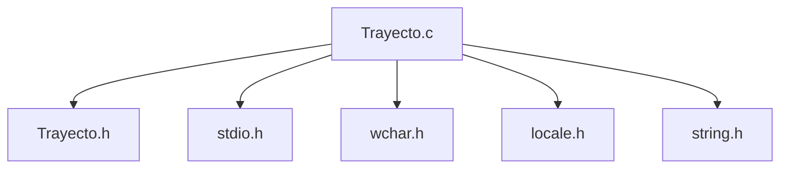
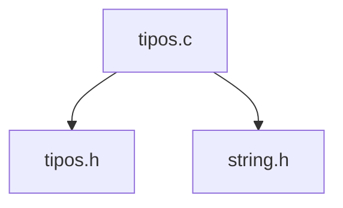

# | **ESI-Share**

## _**Metodología de la Programación**_

_1º Grado en Ingeniería Informática_


*Juan Manuel Caucelo Rodríguez*

*Jose Bello González*

*Pablo Rivero Galvín*

*Santiago Sánchez Loureiro*

***


## **| Vista General de Contenidos**

[TOC]

### 1. **Objeto del Proyecto**

***

Proyecto de la asignatura de Metodología de la Programación de la Universidad de Cádiz. 1º curso del Grado en Ingeniería Informática.

El grupo compuesto por los integrantes mencionados en la portada del proyecto se compremete al desarrollo de un programa en C capaz de permitir viajes a la Escuela Superior de Ingeniería en vehículos compartidos. Objetivos fundamentales:

* Aprender a realizar una descomposición adecuada del problema en distintos módulos, maximizando la cohesión y minimizando el acoplamiento. 
* Aprender a resolver problemas descomponiéndolos en diferentes módulos (ficheros) y realizar compilación separada. 
* Aprender a documentar programas. 
* Realizar el desarrollo de un programa trabajando en equipo de manera organizada.

### 2. **Documentación de Usuario**

***

#### 2.1 **Descripción Funcional**

Tal y como se ha comentado anteriormente, ESI-Share busca ofrecer un servicio de transporte útil a la comunidad universitaria que conforma la Escuela Superior de Ingeniería de la Universidad de Cádiz.

A través de una interfaz simple dependiente de teclado se permite al usuario manejar las distintas funcionalidades que ofrece ESI-Share. El usuario podrá ofrecer o pedir plaza en algún vehículo acompañado del importe correspondiente en la fecha y horas deseadas, incluyendo herramientas de moderación y administración de usuario para facilitar la gestión de la aplicación.

La aplicación incluye herramientas capaces de facilitar la tarea de gestión y administración, es decir, herramientas de moderación. Así, se hace uso de un sistema de identificación de usuario que distingue entre dos categorías de usuario:

* **Usuario** propiamente dicho - Dispone de funcionalidades de apertura de viajes de ida y/o vuelta a la ESI, así como una cómoda interfaz que facilita la administración de los viajes disponibles y vehículos de los que dispone el usuario.
* **Administrador** - Cuenta con herramientas de gestión de usuario, vehículo y viaje que permiten mantener un entorno funcional y útil en la aplicación.

#### 2.2 **Tecnología**

 Las herramientas utilizadas en el desarrollo de la aplicación (tanto de programación como de documentación) son las siguientes:

1. [CodeBlocks](https://sourceforge.net/projects/codeblocks/), para la generación de código.
2. [Dev C++](https://sourceforge.net/projects/orwelldevcpp/), para la generación de código.
3. [Visual Studio Code](https://code.visualstudio.com/), para la generación de código.
4. [Typora](https://typora.io), para la generación de documentación.


#### 2.3 **Manual de Instalación**

ESI-Share puede ser descargado por cualquier persona con conexión a internet y acceso a un navegador convencionar (ej. Google Chrome, Opera y sus variantes, Brave, etc...), de manera que puede descargarse gratuitamente desde nuestro repositorio en [GitHub](https://github.com/prvgal/ESI-SHARE). 

ESI-Share cuenta con exigencias mínimas de prestaciones de equipo, de manera que prácticamente cualquier equipo con los componentes básicos de un ordenador (todos ellos funcionales) será capaz de ejecutar la aplicación de forma fluida e ininterrumpida. Requisitos básicos orientativos:

* Sistema Operativo Windows XP.
* 512MB de RAM libres.
* 100MB de espacio libre en memoria.

#### 2.4 **Acceso al Sistema**

El acceso a ESI-Share es realizado a través de una ventana de Log-In similar a muchas otras aplicaciones. El usuario deberá introducir un usuario y contraseña adecuados. 

​		*Menú de Log-In*

> ​				ESI-Share
>
> Usuario:
>
> Contraseña:

Cuando este no es capaz de hacer log-in, cuenta con varias opciones:

* Registrarse - Crear una nueva cuenta, si no tiene.
* Restablecer su contraseña -  Por precaución, un miembro de la administración de la aplicación revisará el cambio de contraseña para evitar robos de cuenta.

​		 *Menú de opciones de acceso*

> ¿No tiene una cuenta o ha olvidado su contrasena?
>
> <1> Para seguir con el Inicio de Sesion.
>
> <2> Para Registrarse.
>
> <3> Para restablecer la contraseña.
>
> <0> Para cerrar ESI-SHARE.

 Para salir del sistema no hace falta más que volver al menú de inicio y elegir la opción de salida.

​		*Menú de Inicio*

> ​			MENU
>
> ​		OPCIONES
>
> <1> Perfil
>
> <2> Vehículos
>
> <3> Viajes
>
> <0> Cerrar ESI-Share

En caso de que el usuario se encuentre en otro menú, deberá marcar la opción de "Volver" hasta regresar al menú anterior.

El procedimiento seguido por el administrador es análogo al de usuario, salvo que el menú de inicio ofrece funcionalidades distintas al usuario promedio.

*Menú de Inicio - Admin*

> ​			MENU
>
> ​		OPCIONES
>
> <1> Usuarios.
>
> <2> Vehículos.
>
> <3> Viajes.
>
> <0> Cerrar ESI-Share.

### 3. **Documentación del Sistema**

***

Documentación referida a los aspectos del análisis, diseño, implementación y prueba del software, así como la implantación del mismo. Esta sección está orientada a los programadores encargados del mantenimiento del sistema. 

#### 3.1 **Especificación del Sistema**

La estructura modular seguida en el desarrollo de ESI-Share queda representada por el siguiente diagrama.

---

*Diseño Modular*

---



*Nota: La flecha significa que el primero utiliza elementos del segundo*

El proyecto se ha abarcado descomponiendo el problema principal en los módulos expuestos anteriormente. La función de todos ellos se expone más adelante en secciones dedicadas a cada uno de ellos.

##### 3.1.1 **Módulos**

###### I. **Menu**

***

*Gráfico de dependencias*

````mermaid
graph TD
A[menu.c] --> B[perfiles.h]
A --> C[stdio.h]
````

***

Posibilita el inicio de sesión y acceso a los demás módulos.  Recibe datos únicamente de perfiles, que a su vez recibe otros datos de los demás módulos. 

Este módulo cuenta únicamente con un main a partir del cuál se utiliza la plataforma ESI-Share.

###### II. **Perfiles **

***

*Gráfico de dependencias*



*Nota: Recordamos que todos los módulos principales utilizan funciones multiusos de tipos.h*

***

Toda la información referente al usuario estará almacenada en el fichero "Usuarios.txt". Incluye etiquetas para:

* Indicar si el perfil es de administrador o de usuario.
* Indicar si la cuenta se encuentra cerrada o abierta.

Incluirá otros datos como la ID de usuario, nombre real, nombre de usuario, localidad y contraseña de la cuenta. Cada dato se guarda en el fichero separado por guiones.

>0001-Juan Perez-San Fernando-administrador-admin-jp123456-1
>
>ID-Nombre Real-Localidad-Tipo de Perfil-Usuario-Contraseña-Estado

Este módulo podría definirse como un puente de unión entre Menu y los demás módulos del proyecto. Cede datos tales como IDs y nombres de usuario, y recibe otros como pueden ser vehículos y viajes asociados a una cuenta. Engloba todas las interfaces principales que se muestran al usuario promedio y al administrador por igual.

***Macros***
```C
#define ID 5
#define MAX_N 21
#define MAX_L 21
#define MAX_PU 14
#define MAX_U 6
#define MAX_C 9
#define MAX_E 10
#define MAX_LIN_FICH 70
```

***Estructuras de Datos***

- Información de perfil asociado a un usuario.

```C
typedef struct {
    char Id_usuario[ID];        // 4 dígitos.
    char Nomb_usuario[MAX_N];   // 20 caracteres mas el \0. Nombre completo del usuario
    char Localidad[MAX_L];      // 20 caracteres mas el \0. Ubicación de donde sale el usuario con su vehículo compartido.
    char Perfil_usuario[MAX_PU];    // 13 caracteres (administrador) incluyendo el \0. Verifica si el usuario es administrador o de tipo usuario
    char Usuario[MAX_U];        // 5 caracteres mas el \0. Nombre de usuario para acceder al sistema.
    char Contrasena[MAX_C];     // 8 caracteres mas el \0. 
    char estado;     // Dos posibles estados, activo (1) / bloqueado (0). 
} tPerfil;
```

***Funciones Públicas***

* int Inicio(tPerfil **);*

```C
// Precondición: Recibe la dirección de memoria donde se encuentra la primera posición del vector de estructuras de tipo tPerfil debe estar inicializada con antelación.
// Poscondición: Devuelve la posición donde se encuentra el usuario en el vector de estructuras de tipo tPerfil

int Inicio(tPerfil *infoper){
    int op, posUsuario;     // posUsuario contendrá la posición en el vector de estructuras donde se encuentre el usuario que ha iniciado sesión/registrado correctamente
    char usuario[MAX_U], contrasena[MAX_C];

    system("cls");
    ImprimirESISHARE();
    printf("\nBienvenido.");

    do{
        printf("\n#            LOG-IN            #\n");

        fflush(stdin);

        // Recogemos el usuario y la contraseña
        PreguntarUsuario(usuario);
        fflush(stdin);
        ObtenerContrasena(contrasena);

        // Validamos si el usuario, la contraseña, o ambas son correctas.
        if(!ValidarLogin(infoper, usuario, contrasena, &posUsuario)){
            system("cls");
            fprintf(stderr, "Error, el usuario o la contrasena son incorrectas\n"); // Mensaje de error si hay algo que no es correcto

            // Permitimos la opcion de seguir con el Inicio de Sesión, Registrarse o cerrar la aplicación.
            do{
                printf("\nNo tienes una cuenta o ha olvidad su contrasena?\n");
                printf("<1> Para seguir con el Inicio de Sesion.\n");
                printf("<2> Para Registrarse.\n");
                printf("<0> Para cerrar ESI-SHARE.\n");
                
                printf("\nIngrese el numero: ");

                if(scanf("%i", &op) != 1){      // Con esta condición podemos evitar que el usuario haga una entrada errónea.
                    system("cls");
                    fflush(stdin);
                    fprintf(stderr, "\nEntrada no valida. Debe ser un numero.");
                } else{
                    switch(op){
                    case 0: exit(1); break;
                    case 1: posUsuario = Inicio(infoper); break;
                    case 2: posUsuario = SignUp(infoper); break;
                    default: printf("\nIngrese un numero dentro del rango de opciones.\n"); break;
                    }
                }

            } while(op != 1 && op != 2 && op != 3);
        } 

        // Verificamos si está activo (1) o bloqueado (0) el usuario que desea Iniciar sesión. En caso de que se haya registrado, estará activado por defecto.
        if(infoper[posUsuario].estado == '0'){  
            fprintf(stderr, "\nError, el usuario se encuentra bloqueado.");
            exit(1);    // Si el usuario está bloqueado se cerrará la aplicación.
        } else{
            system("cls");
            printf("\nBienvenido/a %s.\n", infoper[posUsuario].Nomb_usuario);
        }

    } while(!ValidarLogin(infoper, infoper[posUsuario].Usuario, infoper[posUsuario].Contrasena, &posUsuario));

    return posUsuario;  // Devolvemos la posición del usuario en el vector para su uso en otras funciones y no perder qué usuario accedió iniciando sesión.
}
```

*Pide al usuario introducir la información necesaria para ingresar ESI-SHARE. Este procedimiento se diseñó como el principal del programa.* 

* void Menu(tPerfil *infoper, int posUsua);*

```C
// Precondición: Debe haberse iniciado sesión o registrado con antelación. Recibe la dirección de memoria del primer elemento del vector de estructuras tipo tPerfil
//               y un entero que se corresponde con la posición del usuario que inicio sesión o se registró con antelación
// Poscondición: Dependiendo del tipo de perfil que tenga el usuario, desembocará a un menú u otro, en caso de ser administrador, se llama a MenuAdmin, en caso de no serlo, se llama a MenuUser

void Menu(tPerfil *infoper, int posUsua){
    // Según el inicio de sesión o registro, se verifica si el usuario con posición posUsua es admin o usuario corriente.
    // Esto es debido a que el usuario corriente no tiene el mismo menú que el administrador y viceversa.
    if(!strcmp(infoper[posUsua].Perfil_usuario, "administrador"))
        MenuAdmin(infoper, posUsua);
    else
        MenuUser(infoper, posUsua);
}
```
*Comprueba si la etiqueta que identifica si un perfil es de tipo administrador o usuario. Este procedimiento se diseñó para redirigir a dos versiones del menú según el tipo de perfil del usuario.* 

* void tPerfil **CrearListaDePerfiles(void);*

```C
// Precondición: Nada
// Poscondición: Devuelve un vector de tipo tPerfil del tamaño equivalente al numero de usuarios guardados en Usuarios.txt

tPerfil *CrearListaDePerfiles(void){
    tPerfil *perfiles;
    // Reservamos la memoria necesaria gracias a la función LongitudVectorEstructuras()
    if(LongitudVectorEstructuras() == 0)
        perfiles = (tPerfil *)calloc(LongitudVectorEstructuras()+1, sizeof(tPerfil)); 
    else
        perfiles = (tPerfil *)calloc(LongitudVectorEstructuras(), sizeof(tPerfil));

    if(perfiles == NULL){   // Comprobamos si surge algún error en la asignación
        fprintf(stderr, "Error en la asignacion de memoria.");
        exit(1);
    }

    return perfiles;    // Devolvemos dicho vector.
}
```

*Crea un vector de estructuras de tipo tPerfil con el tamaño del total de usuarios registrados en Usuarios.txt y después, lo devuelve.* 

* void GenerarID(char **id, int num, int numDigitos);*

```C
// Precondición: recibe una cadena de caraacteres y dos enteros, uno para el numero que queremos realizar la ID y el numero de dígitos de esa ID.
// Poscondición: guarda en id una cadena de caracteres, por ejemplo, si num = 12 y numDigitos = 4, en id se encontrará 0012

void GenerarID(char *id, int num, int numDigitos){
    sprintf(id, "%0*d", numDigitos, num);   // Transformamos num en ID con el numero de dígitos almacenados en numDigitos
}
```

*Genera una ID, según el numero y los dígitos que le pasemos por parámetros. Este procedimiento se ha creado debido a la necesidad en diferentes parte del desarrollo para generar ID's.* 

* void CargarPerfiles(tPerfil **infoper);*

```C
// Precondición: Recibe un vector de estructuras tipo tPerfil, el cual, deberá tener un tamaño mínimo, en caso de no tenerlo, llama a SignUp para crear un nuevo usuario.
// Poscondición: carga toda la información de Usuarios.txt en el vector de estructuras de tipo tPefil.

void CargarPerfiles(tPerfil *infoper){
    int i;
    char buffer[MAX_LIN_FICH];

    if(LongitudVectorEstructuras() != 0){    // Comprobamos si existe algún usuario en Usuarios.txt
        FILE *pf;

        pf = fopen("Usuarios.txt", "r");    // Abrimos el fichero en tipo lectura.

        if(pf == NULL){     // Comprobamos si su apertura es correcta.
            fprintf(pf, "Error en la apertura de archivos.\n");
            exit(1);
        }

        for(i = 0; i < LongitudVectorEstructuras(); i++){   // Recorremos el vector
        // Cogemos línea por línea, ya que sabemos que MAX_LIN_FICH es el máximo que ocupara cada línea de Usuarios.txt
        // Tras recoger una línea completa, eliminamos el \n y lo transformamos por un \0, y dicha cadena la metemos en los campos de infoper gracias a sscanf.
        if(fgets(buffer, MAX_LIN_FICH, pf) != NULL){
            buffer[strcspn(buffer, "\n")] = '\0';
            sscanf(buffer, "%[^-]-%[^-]-%[^-]-%[^-]-%[^-]-%[^-]-%c", infoper[i].Id_usuario, infoper[i].Nomb_usuario, 
                                                                     infoper[i].Localidad, infoper[i].Perfil_usuario, 
                                                                     infoper[i].Usuario, infoper[i].Contrasena, &infoper[i].estado);
            }
        }

        fclose(pf); // Cerramos fichero.
    }
}
```

*Carga del archivo "Usuarios.txt" y almacena su contenido en el vector de estructuras de tipo tPerfil.* 

***Funciones Privadas***

* static int ValidarID(tPerfil *infoper, char id[ID], int *posUsua, int tam);*

```C
// Precondición: recibe un vector de estructuras tPerfil, una cadena de caracteres (ID), una dirección de memoria a la variable que contenga la posición del usuario
//               y una variable que contenga el tamaño del vector de estructuras tPerfil.
// Poscondición: Devuelve 1 si la ID es válida, es decir, si la ID se encuentra en el registro y 0 en caso contrario.

static int ValidarID(tPerfil *infoper, char id[ID], int *posUsua, int tam){
    int i, boole = 0;

    for(i = 0; i < tam && !boole; i++){     // Recorremos el vector
        if(!strcmp(infoper[i].Id_usuario, id))  
            boole = 1;                      // 1 si lo hemos encontrado
    }

    *posUsua = i-1;     // Acutalizamos el contenido de posUsua, ya que la posición será donde ha encontrado la ID menos 1.

    return boole;       // Devolvemos
}
```

*Se ha desarrollado con el propósito de retornar un valor de 1 en caso de que la identificación ingresada sea considerada válida, es decir, se encuentre registrada en el archivo de Usuarios.txt. En caso contrario, la función devolverá un valor de 0. Es importante destacar que este desarrollo se realizó con el objetivo de proporcionar un control adecuado sobre las identificaciones ingresadas por parte del usuario durante la ejecución de ESI-SHARE, permitiendo así una verificación previa de dicha información.* 


* static void MenuAdmin(tPerfil *infoper, int posUsua);

```C
// Precondición: Debe haberse iniciado sesión o registrado con antelación. Recibe la dirección de memoria del primer elemento del vector de estructuras tipo tPerfil
//               y un entero que se corresponde con la posición del usuario que inicio sesión o se registró con antelación.
// Poscondición: Menu de opcinoes que desembocará en otro menú de configuración dependiendo de las opciones elegidas por el administrador.

static void MenuAdmin(tPerfil *infoper, int posUsua){
    int op;

    printf("\n###################################\n");
    printf("#               MENU              #\n");
    printf("###################################\n\n");

    printf("%s", infoper[posUsua].Perfil_usuario);

    do{
        printf("\n\n#            OPCIONES            #\n");
       
        printf("\n<1> Usuarios.\n");
        printf("<2> Vehiculos.\n");
        printf("<3> Viajes.\n");
        printf("<0> Para cerrar ESI-SHARE\n");

        printf("\nIngrese la opcion que desee: ");
        
        if(scanf("%i", &op) != 1){  // Con esta condición podemos evitar que el usuario haga una entrada errónea.
            system("cls");
            fflush(stdin);
            fprintf(stderr, "\nEntrada no valida. Debe ser un numero.");
        } else{
            system("cls");
            ImprimirESISHARE();

            switch(op){
                case 0: exit(1); break;
                case 1: Usuarios(infoper); break;
                // case 2: Vehiculos(); break;
                case 3: menuviajes(infoper[posUsua].Id_usuario, infoper[posUsua].Perfil_usuario); break;
                default: printf("\nElige una de las opciones.\n"); break;
            }
        }

    } while(op != 0);
}
```

*Esta función ha sido diseñada con el propósito de servir como un medio para acceder a las funciones generales del programa si el usuario que Inicio Sesión fue el administrador.* 

* static void MenuUser(tPerfil **infoper, int posUsua);*

```C
// Precondición: Debe haberse iniciado sesión o registrado con antelación. Recibe la dirección de memoria del primer elemento del vector de estructuras tipo tPerfil
//               y un entero que se corresponde con la posición del usuario que inicio sesión o se registró con antelación.
// Poscondición: Menu de opcinoes que desembocará en otro menú de configuración dependiendo de las opciones elegidas por el usuario.

static void MenuUser(tPerfil *infoper, int posUsua){
    int op;

    printf("\n###################################\n");
    printf("#               MENU              #\n");
    printf("###################################\n");

    printf("Usuario: %s", infoper[posUsua].Nomb_usuario);

    do{
        printf("\n\n#            OPCIONES            #\n");
       
        printf("\n<1> Perfil.\n");
        printf("<2> Vehiculos.\n");
        printf("<3> Viajes.\n");
        printf("<0> Para cerrar ESI-SHARE\n");

        printf("\nIngrese la opcion que desee: ");

        if(scanf("%i", &op) != 1){  // Con esta condición podemos evitar que el usuario haga una entrada errónea.
            system("cls");
            fflush(stdin);
            fprintf(stderr, "\nEntrada no valida. Debe ser un numero.");
        } else{
            system("cls");
            ImprimirESISHARE();

            switch(op){
                case 0: exit(1); break;
                case 1: Perfil(infoper, posUsua); break;
                // case 2: Vehiculos(); break;
                case 3: menuviajes(infoper[posUsua].Id_usuario, infoper[posUsua].Perfil_usuario); break;
                default: printf("\nElige una de las opciones.\n"); break;
            }
        }

    } while(op != 0);
}
```

*Esta función ha sido diseñada con el propósito de servir como un medio para acceder a las funciones generales del programa si el usuario que Inicio Sesión fue el usuario.* 

* static void Perfil(tPerfil **infoper, int posUsua);*

```C
// Precondición: Debe haberse iniciado sesión o registrado y haber pasado por MenuUser anteriormente. Recibe la dirección de memoria del primer elemento del vector de estructuras tipo tPerfil
//               y un entero que se corresponde con la posición del usuario que inicio sesión o se registró con antelación..
// Poscondición: Menu de opcinoes que desembocaró en diferentes opciones de configuración.

static void Perfil(tPerfil *infoper, int posUsua){
    int op;

    printf("\n#######################################################\n");
    printf("#               Configuracion del Perfil              #\n");
    printf("#######################################################\n\n");

    printf("Usuario: %s.", infoper[posUsua].Nomb_usuario);

    do{
        printf("\n\n#            OPCIONES de Configuracion            #\n");
       
        printf("\n<1> Cambiar algun dato de la cuenta.\n");
        printf("<0> Para volver al menu.\n");

        printf("\nIngrese la opcion que desee: ");
        
        if(scanf("%i", &op) != 1){  // Con esta condición podemos evitar que el usuario haga una entrada errónea.
            system("cls");
            fflush(stdin);
            fprintf(stderr, "\nEntrada no valida. Debe ser un numero.");
        } else{
            system("cls");
            ImprimirESISHARE();

            switch(op){
                case 0: break;
                case 1: ModificarCamposUsuario(infoper, posUsua); break;
                default: printf("\nElige una de las opciones.\n"); break;
            }
        }

    } while(op != 0);
}
```

*Función que revisa si el usuario desea cambiar algun dato de la cuenta o desea regresar al menú. Este procedimiento está pensado para ser un intermediario entre funciones* 

* static void Usuarios(tPerfil **infoper);*

```C
// Precondición: Debe haberse iniciado sesión o registrado y haber pasado por MenuAdmin anteriormente. Recibe la dirección de memoria del primer elemento del vector de estructuras tipo tPerfil
//               y un entero que se corresponde con la posición del usuario que inicio sesión o se registró con antelación..
// Poscondición: Menu de opcinoes que desembocará en diferentes opciones de configuración.

static void Usuarios(tPerfil *infoper){
    int op;

    printf("\n##################################################################\n");
    printf("#               Configuracion del Sistema de Usuarios              #\n");
    printf("####################################################################\n\n");

    do{
        printf("\n\n#            OPCIONES de Configuracion            #\n");
       
        printf("\n<1> Listar usuarios del sistema.\n");
        printf("<2> Para dar de alta a un usuario.\n");
        printf("<3> Para dar de baja a un usuario.\n");
        printf("<4> Para modificar datos de algun usuario.\n");
        printf("<0> Para volver al menu.\n");

        printf("\nIngrese la opcion que desee: ");

        if(scanf("%i", &op) != 1){  // Con esta condici�n podemos evitar que el usuario haga una entrada err�nea.
            system("cls");
            fflush(stdin);
            fprintf(stderr, "\nEntrada no valida. Debe ser un numero.");
        } else{
            system("cls");
            ImprimirESISHARE();

            switch(op){
                case 0: break;
                case 1: ListarPerfiles(infoper); break;
                case 2: SignUp(infoper); break;
                case 3: BajaUsuario(infoper); break;
                case 4: ModificarCamposAdmin(infoper); break;
                default: printf("\nElige una de las opciones.\n"); break;
            }
        }

    } while(op != 0);
}
```

*La función en cuestión se encarga de verificar si el administrador desea listar los perfiles de ESI-SHARE, dar de alta o baja a algún usuario o modificar los campos de algún usuario; o bien, desea regresar al menú principal. Este proceso actúa como un intermediario entre las diversas funciones del programa. En caso de que se mencione alguna de las opciones anteriores, se procede a redirigir al usuario al menú correspondiente.* 

* static void ImprimirESISHARE(void);*

```C
// Precondición: Nada
// Poscondición: Imprime ESI-SHARE por pantalla.

static void ImprimirESISHARE(void){
    printf("###################################\n");
    printf("#            ESI-SHARE            #\n");
    printf("###################################\n");
}
```

*La función en cuestión tiene como objetivo presentar en pantalla el nombre del programa con la finalidad de mejorar estéticamente los menús* 

* static void ReservarNuevoPerfil(tPerfil **infoper);*

```C
// Precondición: Recibe un vector de estructuras tipo tPerfil, el cual, debe estar inicializado o no.
// Poscondición: En caso de que en Usuarios.txt no se encuentre ningun usuario, esta función reserva memoria para uno nuevo, en caso contrario, si se encuentran n usuarios,
//               reservará memoria para n+1.

static void ReservarNuevoPerfil(tPerfil *infoper){
    if(LongitudVectorEstructuras() == 0)    // Comprobación del numero de usuarios para después proceder con la reserva.
        infoper = (tPerfil *)calloc(LongitudVectorEstructuras() + 1, sizeof(tPerfil));
    else
        infoper = (tPerfil *)realloc(infoper, (LongitudVectorEstructuras() + 1)*sizeof(tPerfil));

    if(infoper == NULL){    // Comprobamos si surge algún error en la asignación
        fprintf(stderr, "Error en la asignacion de memoria.");
        exit(1);
    }
}
```

*La función tiene como objetivo verificar si existe algún usuario en el archivo llamado "Usuarios.txt". En caso de que no se encuentre ningún usuario registrado en dicho archivo, la función creará espacio de memoria para añadir un nuevo usuario. En cambio, si ya existen n usuarios registrados en el archivo, entonces la función creará espacio de memoria suficiente para agregar un nuevo usuario, es decir, reservará memoria para n+1 usuarios en total.* 

* static int ValidarLogin(tPerfil *infoper, char usuario[MAX_U], char contrasena[MAX_C], int **pos);*

```C
// Precondición: recibe una dirección de memoria a la primera posición del vector infoper, dos cadenas de caracteres y la dirección de memoria de la variable que almacenará la posición del usuario
//               del cual queremos ver si existe o no.
// Poscondición: Devuelve 1 si se ha encontrado en el registro y 0 si no se ha encontrado

static int ValidarLogin(tPerfil *infoper, char usuario[MAX_U], char contrasena[MAX_C], int *pos){
    int i = 0, fin = 0, boole = 0;

    // Comprobemos primero los usuarios
    while(i < LongitudVectorEstructuras() && !fin){
        if(strncmp(infoper[i].Usuario, usuario, MAX_U-1) == 0 && strlen(usuario) == strlen(infoper[i].Usuario))
            fin = 1;

        i++;
    }

    i -= 1;

    // Luego, comprobamos la contraseña de ese usuario.
    if(strncmp(infoper[i].Contrasena, contrasena, MAX_C-1) == 0 && strlen(contrasena) == strlen(infoper[i].Contrasena))
        boole = 1;

    *pos = i;   // El contenido de pos ahora valdrá i, es decir, donde encontramos el usuario.

    return boole;   // Devolvemos 1 o 0
}
```

*Se ha desarrollado con el propósito de retornar un valor de 1 en caso de que los datos después de iniciar sesión sean correctos, es decir, que se encuentre registrado en el archivo de Usuarios.txt. En caso contrario, la función devolverá un valor de 0. Es importante destacar que este desarrollo se realizó con el objetivo de proporcionar un control adecuado sobre el Inicio de Sesión ingresadas por parte del usuario durante la ejecución de ESI-SHARE, permitiendo así una verificación previa de dicha información.* 

* static int SignUp(tPerfil **infoper);*

```C
// Precondición: recibe una dirección de memoria a la primera posición del vector infoper.
// Poscondición: añade en el vector de estructuras tPerfil un nuevo usuario e imprime en Usuarios.txt los datos de ese nuevo usuario.

static int SignUp(tPerfil *infoper){
    FILE *pf;
    int numPerfiles = LongitudVectorEstructuras();

    pf = fopen("Usuarios.txt", "a");

    if(pf == NULL){
        fprintf(stderr, "Error en la apertura de ficheros.");
        exit(1);
    }

    ReservarNuevoPerfil(infoper);   // Reservamos un nuevo espacio de memoria

    GenerarID(infoper[numPerfiles].Id_usuario, numPerfiles+1, ID-1);    // Generamos la ID para un nuevo usuario

    ObtenerNombreUsuario(infoper[numPerfiles].Nomb_usuario);            // Preguntamos/Obtenemos el nombre de usuario

    ObtenerLocalidad(infoper[numPerfiles].Localidad);                   // Preguntamos/Obtenemos la localidad.

    // El inicio de sesión será por defecto de tipo usuario, este campo solo lo podrá cambiar el administrador.
    strcpy(infoper[numPerfiles].Perfil_usuario, "usuario"); 

    ObtenerUsuario(infoper, infoper[numPerfiles].Usuario);              // Preguntamos/Obtenemos el usuario

    ObtenerContrasena(infoper[numPerfiles].Contrasena);                 // Preguntamos/Obtenemos la localidad.

    // Por defecto el usuario estará activo.
    infoper[numPerfiles].estado = '1';

    //mod reg veh

    // Imprimimos al final del fichero los nuevos datos.
    if(LongitudVectorEstructuras() == 0)
        fprintf(pf, "\n%s-%s-%s-%s-%s-%s-%c", infoper[numPerfiles].Id_usuario, infoper[numPerfiles].Nomb_usuario,
                                          infoper[numPerfiles].Localidad, infoper[numPerfiles].Perfil_usuario,
                                          infoper[numPerfiles].Usuario, infoper[numPerfiles].Contrasena, 
                                          infoper[numPerfiles].estado);
    else
        fprintf(pf, "%s-%s-%s-%s-%s-%s-%c", infoper[numPerfiles].Id_usuario, infoper[numPerfiles].Nomb_usuario,
                                          infoper[numPerfiles].Localidad, infoper[numPerfiles].Perfil_usuario,
                                          infoper[numPerfiles].Usuario, infoper[numPerfiles].Contrasena, 
                                          infoper[numPerfiles].estado);

    printf("\nBienvenido/a %s.\n", infoper[numPerfiles].Nomb_usuario);

    fclose(pf); // Cerramos el fichero

    return numPerfiles; // Devuelve la posición del vector donde deberá encontrarse el usuario.
}
```

*Se ha desarrollado con el propósito de poder crear un nuevo usuario, por lo que si el usuario que accede a la aplicación no tiene una cuenta creada/registrada, pueda crearse una.* 

* static void BajaUsuario(tPerfil **infoper);*

```C
// Precondición: recibe una dirección de memoria a la primera posición del vector infoper.
// Poscondición: elimina tanto en el registro tPerfil tanto como en el fichero Usuarios.txt el usuario seleccionado.

static void BajaUsuario(tPerfil *infoper){
    FILE *pf; 
    char id[ID];
    int i, j, pos, tamOriginal = LongitudVectorEstructuras(); 

    printf("\n####################################################################\n");
    printf("#               Configuracion del Sistema de Bajas                 #\n");
    printf("####################################################################\n\n");
    
    ListarPerfiles(infoper);    // Listamos los perfiles con todos sus datos.

    pf = fopen("Usuarios.txt", "w");

    fclose(pf);  // Elminamos el contenido de Usuarios.txt para despu�s sobreescribirlo y no tener ningún problema.

    pf = fopen("Usuarios.txt", "a");    // Lo abrimos nuevamente, esta vez en modo append

    if(pf == NULL){     // Comprobamos si su apertura es correcta
        fprintf(stderr, "Error en la apertura de archivos.");
        exit(1);
    }
    
    do{
        ObtenerID(infoper, id, tamOriginal); // Obtenemos la ID
        
        for(i = 0; i < tamOriginal; i++){
            // En caso de que la ID sea la de un admin, no se podrá dar de baja.
            if(!strcmp(infoper[i].Perfil_usuario, "administrador") && !strcmp(infoper[i].Id_usuario, id)){
                fprintf(stderr, "No se puede dar de baja a un admin.");     

                // Reescribimos en el fichero los datos.
                for(j = 0; j < tamOriginal; j++){
                    if(j+1 == tamOriginal)
                        fprintf(pf, "%s-%s-%s-%s-%s-%s-%c", infoper[j].Id_usuario, infoper[j].Nomb_usuario,
                                                            infoper[j].Localidad, infoper[j].Perfil_usuario,
                                                            infoper[j].Usuario, infoper[j].Contrasena, infoper[j].estado);
                    else
                        fprintf(pf, "%s-%s-%s-%s-%s-%s-%c\n", infoper[j].Id_usuario, infoper[j].Nomb_usuario,
                                                              infoper[j].Localidad, infoper[j].Perfil_usuario,
                                                              infoper[j].Usuario, infoper[j].Contrasena, infoper[j].estado);

                    }

                exit(1);
            }
        }

    } while(!ValidarID(infoper, id, &pos, tamOriginal));

    system("cls");

    // Algoritmo para eliminar el usuario, se trata en sobreescribir de izquierda a derecha todos los datos.
    for(; pos < tamOriginal-1; pos++)
        infoper[pos]= infoper[pos+1];

    infoper = (tPerfil *)realloc(infoper, (tamOriginal-1)*sizeof(tPerfil)); // Realizamos un realloc a para una posición menos.

    if(infoper == NULL){    // Comprobamos si se reserva bien la memoria
        printf("Error en asignacion de memoria");
        exit(1);
    }

    // Regeneramos las IDs
    for(i = 0; i < tamOriginal-1; i++)
        GenerarID(infoper[i].Id_usuario, i+1, ID-1);
    
    // Reescribimos el archivo.
    for(i = 0; i < tamOriginal-1; i++){
        if(i+1 == tamOriginal-1)
            fprintf(pf, "%s-%s-%s-%s-%s-%s-%c", infoper[i].Id_usuario, infoper[i].Nomb_usuario,
                                                infoper[i].Localidad, infoper[i].Perfil_usuario,
                                                infoper[i].Usuario, infoper[i].Contrasena, infoper[i].estado);
        else
            fprintf(pf, "%s-%s-%s-%s-%s-%s-%c\n", infoper[i].Id_usuario, infoper[i].Nomb_usuario,
                                                  infoper[i].Localidad, infoper[i].Perfil_usuario,
                                                  infoper[i].Usuario, infoper[i].Contrasena, infoper[i].estado);

    }

    fclose(pf);    // Cerramos el fichero
}
```

*Se ha desarrollado con el propósito de poder eliminar un usuario. Esta función solo podrá accederse siendo administrador, si el perfil es de tipo usuario, no podrá accederse a esta función* 

* static void ListarPerfiles(tPerfil **infoper);*

```C
// Precondición: recibe una dirección de memoria a la primera posición del vector infoper.
// Poscondición: Imprime por pantalla todos los usuarios con sus respectivos datos, y también el numero de usuarios registrados en el sistema.

static void ListarPerfiles(tPerfil *infoper){
    int i;

    printf("\nUsuarios registrados: \n");

    // Recorremos el vector e imprimimos todos sus datos
    for(i = 0; i < LongitudVectorEstructuras(); i++)
        printf("%s-%s-%s-%s-%s-%s-%c\n", infoper[i].Id_usuario, infoper[i].Nomb_usuario, 
                                         infoper[i].Localidad, infoper[i].Perfil_usuario,   
                                         infoper[i].Usuario, infoper[i].Contrasena ,infoper[i].estado);
    
    printf("\nNumero de usuarios registrados en el sistema: %i.", i);
}
```

*Se ha desarrollado con el propósito de poder listar todos los usuarios del sistema con todos sus datos. Esta función solo podrá accederse siendo administrador, si el perfil es de tipo usuario, no podrá accederse a esta función* 

* static void ModificarCamposUsuario(tPerfil **infoper, int pos);*

```C
// Precondición: recibe una dirección de memoria a la primera posición del vector infoper y la posición del usuario que incio sesión al principio del programa.
// Poscondición: cambia tanto en el registro como en el fichero, los datos que puede cambiar un perfil de tipo usuario.

static void ModificarCamposUsuario(tPerfil *infoper, int pos){
    int i, op;
    FILE *pf;

    pf = fopen("Usuarios.txt", "r+");   // Abrimos Usuarios.txt para lectura/escritura

    if(pf == NULL){     // Comprobamos si se ha abierto correctamente
        fprintf(stderr, "Error al abrir el archivo.");
        exit(1);
    }

    // Imprimimos todos los datos que el usuario puede cambiar
    printf("\nDatos de su cuenta.\n");

    printf("\nNombre de usuario: %s\n", infoper[pos].Nomb_usuario);
    printf("\nNombre de la localidad: %s\n", infoper[pos].Localidad);
    printf("\nUsuario: %s\n", infoper[pos].Usuario);
    printf("\nContrasena: %s\n", infoper[pos].Contrasena);

    // Preguntamos qué cambiar y en caso de no estar entre las opciones aparecerá un mensaje de error y volverá a preguntar de nuevo.
    do{
        printf("\nQue desea cambiar?\n");
        printf("<1> Para cambiar el nombre de usuario.\n");
        printf("<2> Para cambiar el nombre de su localidad.\n");
        printf("<3> Para cambiar el usuario.\n");
        printf("<4> Para cambiar la contrasena.\n");
        printf("<0> Para no realizar ningun cambio y volver a la configuracion del perfil.\n");
        
        printf("\nIngrese el numero: ");
        
        if(scanf("%i", &op) != 1){  // Con esta condición podemos evitar que el usuario haga una entrada errónea.
            system("cls");
            fflush(stdin);
            fprintf(stderr, "\nEntrada no valida. Debe ser un numero.");
        } else{
            switch(op){
                case 0: system("cls"); break;   
                case 1: ObtenerNombreUsuario(infoper[pos].Nomb_usuario); break;
                case 2: ObtenerLocalidad(infoper[pos].Localidad); break;
                case 3: ObtenerUsuario(infoper, infoper[pos].Usuario); break;
                case 4: ObtenerContrasena(infoper[pos].Contrasena); break;
                default: printf("\nIngrese un numero dentro del rango de opciones.\n"); break;
            }
        }

    } while(op != 0);

    // Reescribimos el fichero
    for(i = 0; i < LongitudVectorEstructuras(); i++){
        if(i+1 == LongitudVectorEstructuras())
            fprintf(pf, "%s-%s-%s-%s-%s-%s-%c", infoper[i].Id_usuario, infoper[i].Nomb_usuario, infoper[i].Localidad, infoper[i].Perfil_usuario,
                                                infoper[i].Usuario, infoper[i].Contrasena, infoper[i].estado);
        else
            fprintf(pf, "%s-%s-%s-%s-%s-%s-%c\n", infoper[i].Id_usuario, infoper[i].Nomb_usuario, infoper[i].Localidad, infoper[i].Perfil_usuario,
                                                  infoper[i].Usuario, infoper[i].Contrasena, infoper[i].estado);

    }

    fclose(pf);     // Cerramos el fichero
}
```

*Función desarrollada para que el usuario pueda modificar sus datos. Aparecerá un listado con los datos que el usuario puede cambiar ya sean el nombre de usuario, la localidad, el usuario y la contraseña.*

* static void ModificarCamposAdmin(tPerfil **infoper);*

```C
// Precondición: recibe una dirección de memoria a la primera posición del vector infoper.
// Poscondición: tras elegir qué usuario cambiar datos, cambia tanto en el registro como en el fichero.

static void ModificarCamposAdmin(tPerfil *infoper){
    FILE *pf;
    char id[ID];
    int i, op, pos;
    
    pf = fopen("Usuarios.txt", "r+");   // Abrimos el fichero para lectura/escritura

    if(pf == NULL){     // Comprobamos si se ha abierto correctamente
        fprintf(stderr, "Error al abrir el archivo.");
        exit(1);
    }

    ListarPerfiles(infoper);    // Listamos los perfiles

    do{
        ObtenerID(infoper, id, LongitudVectorEstructuras()); // Preguntamos/Obtenemos la ID del usuario a cambiar sus datos

        pos = atoi(id) - 1;     // Pasamos la cadena a un numero.

        system("cls");
        printf("\nDatos del usuario con ID: %s\n", id);

        printf("\nNombre de usuario: %s.\n", infoper[pos].Nomb_usuario);
        printf("\nNombre de la localidad: %s.\n", infoper[pos].Localidad);
        printf("\nTipo de perfil: %s.\n", infoper[pos].Perfil_usuario);
        printf("\nUsuario: %s.\n", infoper[pos].Usuario);
        printf("\nContrasena: %s.\n", infoper[pos].Contrasena);
        printf("\nActivo (1) / bloqueado (0): %c.\n", infoper[pos].estado);

        if(!ValidarID(infoper, id, &pos, LongitudVectorEstructuras()))  // Si no se encuentra la ID, mensaje de error.
            fprintf(stderr, "La ID no se encuentra disponible.\n");
        else{
            // En el caso de encontrarse, preguntará que es lo que desea cambiar, en caso de no estar en las opciones, tras un mensaje de error, vuelve a preguntar.
            printf("\nQue desea cambiar?\n");
            printf("\n<1> Para cambiar la ID.\n");
            printf("<2> Para cambiar el nombre de usuario.\n");
            printf("<3> Para cambiar el nombre de su localidad.\n");
            printf("<4> Para cambiar el usuario.\n");
            printf("<5> Para cambiar la contrasena.\n");
            printf("<6> Para activar/bloquear el usuario.\n");
            printf("<0> Para no realizar ningun cambio y volver a la configuracion del perfil.\n");
        
            printf("\nIngrese el numero: ");
        
            if(scanf("%i", &op) != 1){  // Con esta condición podemos evitar que el usuario haga una entrada errónea.
                system("cls");
                fflush(stdin);
                fprintf(stderr, "\nEntrada no valida. Debe ser un numero.");
            } else{
                // Llamada a funciones para realizar dichos cambios
                switch(op){
                    case 0: system("cls"); break;
                    case 1: CambiarID(infoper[pos].Id_usuario); break;
                    case 2: ObtenerNombreUsuario(infoper[pos].Nomb_usuario); break;
                    case 3: ObtenerLocalidad(infoper[pos].Localidad); break;
                    case 4: ObtenerUsuario(infoper, infoper[pos].Usuario); break;
                    case 5: ObtenerContrasena(infoper[pos].Contrasena); break;
                    case 6: infoper[pos].estado = ObtenerEstado(); break;
                    default: printf("\nIngrese un numero dentro del rango de opciones.\n"); break;
                }

                system("cls");
            }
        }

    } while(!ValidarID(infoper, id, &pos, LongitudVectorEstructuras()));

    // Reescribimos el fichero para actualizar todos los cambios que han podido surgir.
    for(i = 0; i < LongitudVectorEstructuras(); i++){
        if(i+1 == LongitudVectorEstructuras())
            fprintf(pf, "%s-%s-%s-%s-%s-%s-%c", infoper[i].Id_usuario, infoper[i].Nomb_usuario, infoper[i].Localidad, infoper[i].Perfil_usuario,
                                                infoper[i].Usuario, infoper[i].Contrasena, infoper[i].estado);
        else
            fprintf(pf, "%s-%s-%s-%s-%s-%s-%c\n", infoper[i].Id_usuario, infoper[i].Nomb_usuario, infoper[i].Localidad, infoper[i].Perfil_usuario,
                                                  infoper[i].Usuario, infoper[i].Contrasena, infoper[i].estado);

    }

    fclose(pf);     // Cerramos el fichero.
}
```

*Función desarrollada para que el administrador pueda modificar los datos y todos los campos de cualquier usuario. Aparecerá un listado con todos los usuarios y todos sus datos. Para elegir qué usuario, se deberá introducir la ID del usuario el cual se desean aplicar modificaciones.* 

* static int LongitudVectorEstructuras(void);*

```C
// Precondición: Nada
// Poscondición: devuelve el numero de líneas que tiene Usuarios.txt, que es a su vez el tamaño que corresponde al vector

static int LongitudVectorEstructuras(void){
    // Sabemos que el fichero Usuarios.txt tendrá tantas líneas como la longitud del vector de estructuras infoper.
    char aux[MAX_LIN_FICH];   // MAX_LIN_FICH es el tamaño máximo que habrá en cada linea, incluyendo los guiones
    FILE *pf;
    int i = 0;
    pf = fopen("Usuarios.txt", "r");    // Abrimos el fichero en modo lectura.
    if(pf == NULL){     // Comprobamos su apertura.
        fprintf(stderr, "Error en la apertura del fichero.");
        exit(1);
    }
    // Hasta qeu no se llegue al fin de fichero, contamos linea a linea
    while(!feof(pf)){
        fgets(aux, MAX_LIN_FICH, pf);
        i++;
    }
    fclose(pf);     // Cerramos el fichero.
    return i;       // Devolvemos i, que es el numero de iteracines del bucle while que es a su vez el numero de lineas que contiene Usuarios.txt
}
```

*La función en cuestión tiene como finalidad principal determinar el número total de perfiles de usuarios que están actualmente almacenados en el archivo denominado "Usuarios.txt". Cabe destacar que se trata de una función de gran utilidad, ya que permitirá a los la cantidad exacta de perfiles registrados en el sistema, lo que resulta fundamental para llevar a cabo diversas actividades relacionadas con la gestión y administración de dichos perfiles.* 

* static void ObtenerNombreUsuario(char **nomUsuario);*

```C
// Precondición: recibe una cadena de caracteres, la cual no debe estar inicializada
// Poscondición: guarda en la cadena el nombre de usuario que se introduzca, con varios mensajes de error en caso de que no sea válida.

static void ObtenerNombreUsuario(char *nomUsuario){
    int i = 0;
    char c;

    printf("\nEscribe el nombre de usuario (maximo 20 caracteres): ");
    fflush(stdin);

    while((c = getchar()) != '\n' && i < MAX_N){    // Recogemos caracter a caracter para controlar el tamaño de entrada
        nomUsuario[i] = c;
        i++;
    }

    nomUsuario[i] = '\0';           // Añadimos el \0 final

    // Comprobamos si el tamaño es correcto, en caso de no serlo, limpiamos la cadena y volvemos a llamar a la función
    if(strlen(nomUsuario) > MAX_N-1){
        printf("El nombre de usuario excede los 20 caracteres.");
        LimpiarCadena(nomUsuario, MAX_N);
        ObtenerNombreUsuario(nomUsuario);
    } 
    
    if(strlen(nomUsuario) == 0){
        printf("El nombre de usuario no puede estar vacio.");
        LimpiarCadena(nomUsuario, MAX_N);
        ObtenerNombreUsuario(nomUsuario);
    } 
}
```

*Este procedimiento está basado en recoger el nombre de usuario y guardarlo en la cadena de caracteres que recibe como parámetro. Imprimirá por pantalla diversos mensajes de error en caso de que no se cumplan los requisitos del nombre de usuario. Por ejemplo, si el nombre de usuario excede de los 20 caractéres o está vacío, volverá a preguntar para introducir el nombre de usuario.* 

* static void ObtenerLocalidad(char **nomLocalidad);*

```C
// Precondición: recibe una cadena de caracteres, la cual no debe estar inicializada
// Poscondición: guarda en la cadena la localidad que se introduzca, con varios mensajes de error en caso de que no sea válida.

static void ObtenerLocalidad(char *nomLocalidad){
    int i = 0;
    char c;

    printf("\nEscribe el nombre de su localidad (maximo 20 caracteres): ");
    fflush(stdin);

    while((c = getchar()) != '\n' && i < MAX_L){        // Recogemos caracter a caracter para controlar el tamaño de entrada
        nomLocalidad[i] = c;
        i++;
    }

    nomLocalidad[i] = '\0';         // Añadimos el \0 final

    // Comprobamos si el tamaño es correcto, en caso de no serlo, limpiamos la cadena y volvemos a llamar a la función
    if(strlen(nomLocalidad) > MAX_L-1){
        printf("El nombre de la localidad excede los 20 caracteres.");
        LimpiarCadena(nomLocalidad, MAX_L);
        ObtenerLocalidad(nomLocalidad);
    }

    if(strlen(nomLocalidad) == 0){
        printf("El nombre de la localidad no puede estar vacio.");
        LimpiarCadena(nomLocalidad, MAX_L);
        ObtenerLocalidad(nomLocalidad);
    }
}
```

*Este procedimiento está basado en recoger el nombre de la localidad y guardarlo en la cadena de caracteres que recibe como parámetro. Imprimirá por pantalla diversos mensajes de error en caso de que no se cumplan los requisitos del nombre de la localidad. Por ejemplo, si el nombre de la localidad excede de los 20 caractéres o está vacío, volverá a preguntar para introducir el nombre de la localidad.* 

* static void ObtenerUsuario(tPerfil *infoper, char **usuario);*

```C
// Precondición: recibe un vector de estructuras tPerfil y una cadena de caracteres, la cual no debe estar inicializada
// Poscondición: guarda en la cadena el usuario que se introduzca, con varios mensajes de error en caso de que no sea válida o se encuentre ya en el registro.

static void ObtenerUsuario(tPerfil *infoper, char *usuario){
    int i = 0, fin = 0;
    char c, aux[MAX_U];

    printf("\nEscribe el usuario (maximo 5 caracteres): ");
    fflush(stdin);

    while((c = getchar()) != '\n' && i < MAX_U){        // Recogemos caracter a caracter para controlar el tamaño de entrada
        aux[i] = c;
        i++;
    }

    aux[i] = '\0';         // Añadimos el \0 final

    // Comprobamos si el tamaño es correcto, en caso de no serlo, limpiamos la cadena y volvemos a llamar a la función
    if(strlen(aux) > MAX_U-1){
        printf("El usuario excede los 5 caracteres.");
        LimpiarCadena(aux, MAX_U);
        ObtenerUsuario(infoper, aux);
    } else if(strlen(aux) == 0){
        printf("El usuario no puede estar vacio.");
        LimpiarCadena(aux, MAX_U);
        ObtenerUsuario(infoper, aux);
    } else {    
        if(LongitudVectorEstructuras() != 0){
            // Si se han pasado las anteriores comprobaciones, hacemos una comprobación final para verificar si el usuario se encuentra en el registro o no
            // en caso de encontrarse, entonces limpia la cadena y vuelve a llamar a la función.
            for(i = 0; i < LongitudVectorEstructuras() && !fin; i++){
                if(!strcmp(infoper[i].Usuario, aux)){
                    fin = 1;
                    printf("El usuario ya se encuentra ocupado.");
                    LimpiarCadena(aux, MAX_U);
                    ObtenerUsuario(infoper, aux);
                }
            }
        }
        
    }

    strcpy(usuario, aux);       // Lo copiamos en user, para que ese valor está almacenado donde el usuario lo haya puesto como parametro
}
```

*A diferencia de las dos anteriores funciones, esta función busca en el registro si existe algún usuario con el mismo nombre que se está obteniendo, en ese caso, aparecerá un mensaje de error diciendo de que ese usuario ya se encuentra ocupado* 

* static void ObtenerContrasena(char **contrasena);*

```C
// Precondición: recibe una cadena de caracteres, la cual no debe estar inicializada
// Poscondición: guarda en la cadena la contraseña que se introduzca, con varios mensajes de error en caso de que no sea válida.

static void ObtenerContrasena(char *contrasena){
    int i = 0;
    char c;

    printf("\nEscribe la contrasena (maximo 8 caracteres): ");
    fflush(stdin);

    while((c = getchar()) != '\n' && i < MAX_C){        // Recogemos caracter a caracter para controlar el tamaño de entrada
        contrasena[i] = c;
        i++;
    }

    contrasena[i] = '\0';       // Añadimos el \0 final

    // Comprobamos si el tamaño es correcto, en caso de no serlo, limpiamos la cadena y volvemos a llamar a la función
    if(strlen(contrasena) > MAX_C-1){
        printf("La contrasena excede los 8 caracteres.");
        LimpiarCadena(contrasena, MAX_C);
        ObtenerContrasena(contrasena);
    }

    if(strlen(contrasena) == 0){
        printf("La contrasena no puede estar vacio.");
        LimpiarCadena(contrasena, MAX_C);
        ObtenerContrasena(contrasena);
    } 
}
```

*Este procedimiento está basado en recoger la contraseña y guardarlo en la cadena de caracteres que recibe como parámetro. Imprimirá por pantalla diversos mensajes de error en caso de que no se cumplan los requisitos de la contraseña. Por ejemplo, si la contraseña excede de los 8 caractéres o está vacío, volverá a preguntar para introducir la contraseña.* 

* static void LimpiarCadena(char **cad, int tam);*

```C
// Precondición: recibe una cadena de caracteres y el tamaño de dicha cadena.
// Poscondición: limpia la cadena poniendo \0 en todas las posiciones de la cadena

static void LimpiarCadena(char *cad, int tam){
    int i;

    for(i = 0; i < tam; i++)    // Recorremos la cadena e introducimos el \0 en cada posición.
        cad[i] = '\0';

}
```

*El procedimiento en cuestión se basa en llevar a cabo una operación consistente en establecer un valor de cero, representado por el carácter "\0", en todas las posiciones de una cadena que tenga una longitud determinada previamente denominada "tam". Esta acción tiene como finalidad eliminar cualquier contenido que pudiera estar presente en la cadena antes de la ejecución del procedimiento. Así podemos garantizar que no quede información residual o evitar errores por datos previos no eliminados.* 

* static void PreguntarUsuario(char **user);*

```C
// Precondición: recibe una cadena de caracteres.
// Poscondición: pregunta y obtiene el usuario, con mensajes de error en caso que no sea valido

static void PreguntarUsuario(char *user){
    int i = 0;
    char c, usuario[MAX_U];

    printf("\nUsuario (maximo 5 caracteres): ");
    fflush(stdin);
        
    while((c = getchar()) != '\n' && i < MAX_U){        // Recogemos caracter a caracter para controlar el tamaño de entrada
        usuario[i] = c;
        i++;
    }

    usuario[i] = '\0';      // Añadimos el \0 final

    // Comprobamos si el tamaño es correcto, en caso de no serlo, limpiamos la cadena y volvemos a llamar a la función
    if(strlen(usuario) > MAX_U-1){
        printf("\nEl usuario tiene de maximo 5 caracteres.\n");
        LimpiarCadena(usuario, MAX_U);
        PreguntarUsuario(usuario);
    }

    strcpy(user, usuario);  // Lo copiamos en user, para que ese valor está almacenado donde el usuario lo haya puesto como parametro
}
```

*Esta función se diferencia de ObtenerUsuario en un aspecto, obtener usuario imprimía un mensaje de error por pantalla en caso de que el usuario ya existiese en el registro. En cambio, está función se trata de preguntar simplemente el usuario, no se encarga de buscar si existe en el registro* 

* static void ObtenerID(tPerfil *infoper, char **id, int tam);*

```C
// Precondición: recibe un vector de estructuras tPerfil, una cadena de caracteres y el tamaño del vector de estructuras.
// Poscondición: pregunta y la ID, con mensajes de error en caso que no sea valido

static void ObtenerID(tPerfil *infoper, char *id, int tam){
    int i = 0, encontrado = 0;
    char c;

    printf("\nIndique la ID (primer campo de usuario) del usuario desea modificar: ");
    fflush(stdin);

    while((c = getchar()) != '\n' && i < ID){       // Recogemos caracter a caracter para controlar el tamaño de entrada
        id[i] = c;
        i++;
    }

    id[i] = '\0';       // Añadimos el \0 final

    for(i = 0; i < tam && !encontrado; i++){    // Recorremos el vector y buscamos si se encuentra o no
        if(!strcmp(id, infoper[i].Id_usuario))
            encontrado = 1;
    }

    // Si no se ha encontrado, limpiamos la cadena y volvemos a llamar a la función
    if(!encontrado){
        printf("\nLa ID no se encuentra en el registro o no tiene 4 caracteres.");
        LimpiarCadena(id, ID);
        ObtenerID(infoper, id, tam);
    }
}
```

*Procedimiento para que el usuario introduzca una ID que debe ser correcta, es decir, que se encuentre en el registro o que no se exceda los 4 caracteres* 

* static void CambiarID(char **id);*

```C
// Precondición: recibe una cadena de caracteres.
// Poscondición: pregunta y la ID, con mensajes de error en caso que no sea valido

static void CambiarID(char *id){
    int i = 0;
    char c;

    printf("\nIntroduzca la nueva ID: ");
    fflush(stdin);

    while((c = getchar()) != '\n' && i < ID){       // Recogemos caracter a caracter para controlar el tamaño de entrada
        id[i] = c;
        i++;
    }

    id[i] = '\0';   // Añadimos el \0 final

    // Comprobamos si el tamaño es correcto, en caso de no serlo, limpiamos la cadena y volvemos a llamar a la función
    if(strlen(id) != ID-1){
        printf("\nLa ID tiene 4 caracteres.");
        LimpiarCadena(id, ID);
        CambiarID(id);
    }
}
```

*El siguiente procedimiento tiene como finalidad proporcionar al usuario la posibilidad de introducir una ID que sea válida. Es importante destacar que, a diferencia de la función ObtenerID, este procedimiento no realiza ninguna verificación referente a si dicha ID se encuentra o no registrada en el archivo "Usuarios.txt". Por lo tanto, su única tarea consiste en almacenar, dentro de una cadena de caracteres, cualquier valor que el usuario escriba y que sea considerado válido según los parámetros establecidos.* 

* static char ObtenerEstado(void);*

```C
// Precondición: Nada.
// Poscondición: Devuelve un char que contiene '1' pasa estar activo o '0' si pasa a estar bloqueados

static char ObtenerEstado(void){
    int aux;

    do{
        printf("\nEstado activo (1) / bloqueado (0): ");
        fflush(stdin);
        scanf("%i", &aux);

        if(aux != 1 && aux != 0)    // Comprobación, no pueden haber datos distintos de 1 y 0
        fprintf(stderr, "\nEl estado debe ser activo (1) / bloqueado (0).");
    
    } while(aux != 1 && aux != 0);

    return (aux + '0'); // Transformamos el numero a cadena.
}
```

*Devuelve un carácter, el cual, representa el estado que se encuentra el perfil, que solo puede ser 1 (activo) o 0 (bloqueado).* 

###### III. **Vehículo **

***

*Gráfico de dependencias*



*Nota: Recordamos que todos los módulos principales utilizan funciones multiusos de tipos.h*

***

Toda la información referente a los vehículos estará almacenada en el fichero "vehiculo.txt". Contendrá datos como la matrícula de cada vehículo, ID de usuario asociada, número de plazas y una breve descripción del vehículo.

>1799HSJ-0001-4-Opel Corsa Blanco Mod. 2007
>
>Matrícula-ID-Plazas-Descrpición del Vehículo

El módulo Vehículo facilita un sistema de gestión de vehículos a nivel tanto de usuario como de administrador. Cuenta con herramientas necesarias para el funcionamiento de otros módulos como Viajes (matrícula, número de plazas...) y Perfiles(funciones de registro de vehículos,  gestión de vehículos de usuario y administrador). Incluye interfaces de registro, y búsqueda y elección de vehículos.

***Estructuras de Datos***

- Información de vehículo asociado a un usuario.

```C
typedef struct{
        char id_mat[IDMAT];         //Matrícula del vehículo (7 caracteres). IDMAT=8
        char id_usuario[IDUSU];     //ID de usuario asociado al vehículo (4 caracteres). IDUSU=5
        char desc_veh[CARACTERES];  //Breve descripción del vehículo (máx 50 carateres). CARACTERES=51
        int num_plazas;             //Número de plazas de las que dispone el vehículo.
}vehiculo_inf;
```

***Funciones Públicas***


* void escribir_fichero(vehiculo_inf, FILE *);*

```C
//Precondición: El procedimiento recibe una estructura ya rellena de tipo vehiculo_inf, y un puntero a fichero en el que escribir.
//Postcondición:  La información contenida en la estructura se habrá almacenado en el fichero.

void escribir_fichero(vehiculo_inf vehiculo, FILE *veh_txt){
        char guion[2]={'-','\0'};
		int i;

        if((veh_txt=fopen("vehiculo.txt","a+"))==NULL){
        	printf("Error al guardar la información");
			}
		else{
				fwrite(vehiculo.id_mat, sizeof(char), 7, veh_txt);
           		fflush(veh_txt);
           		fwrite(guion,sizeof(char),1,veh_txt);
           		fflush(veh_txt);
           		fwrite(vehiculo.id_usuario, sizeof(char), 4, veh_txt);
           		fflush(veh_txt);
				fwrite(guion, sizeof(char),1,veh_txt);
				fflush(veh_txt);
				fprintf(veh_txt,"%i",vehiculo.num_plazas);
				fflush(veh_txt);
				fwrite(guion, sizeof(char),1,veh_txt);
				fflush(veh_txt);
				fwrite(vehiculo.desc_veh, sizeof(char), strlen(vehiculo.desc_veh), veh_txt);
				fflush(veh_txt);
				fprintf(veh_txt,"\n");
		}
	   	fclose(veh_txt);
	}

```

*Escribe la información asociada a un usuario (de ahí que reciba una variable tipo vehiculo_inf) en el fichero vehículo, donde se almacenan todos los vehículos registrados.*

* *void admin_veh();*

```C
//Precondición: Ninguna.
//Postcondición: El administrador habrá elegido alguna de las opciones expuestas en un switch que permite: <1> Dar un vehículo de alta <2> Dar un vehículo de baja <3> Listar todos los vehículos <4> Modificar la información de un vehículo <5> Volver al menú de administrador principal.

void admin_veh(){
		int op,i=0;

		do{
			printf("\n¿Qué desea hacer?\n <1> Dar un vehículo de alta.\n <2> Dar un vehículo de baja.\n <3> Lista de vehículos\n <4> Modificar vehículo.\n <5> Ver la información de un vehículo.\n <0> Volver.\n Elija una opción: ");
			if(scanf("%i",&op)!=1){
				fflush(stdin);
				printf("Error: introduzca una entrada válida.");
				op=-1;
			}
			else{
				switch(op){
					case 1: admin_alta_vehiculo(); break;
					case 2: admin_baja_vehiculo(); break;
					case 3: printf("\n"); listar_vehiculos(); break;
					case 4: admin_modif_veh(); break;
					case 5: listar_viajes(); break;
					case 0: break;
					default: printf("Introduzca una entrada dentro de la lista dada."); i++; if(i>5) printf("\nVenga, que no es complicado: introduce 1, 2, 3 o 4 según lo que necesites.\n"); break;
				}
			}
		}while(op!=0);
	}

```

*Constituye el menú que utilizará un administrador al acceder a la sección de vehículos. Este procedimiento está diseñado para llamar a otros procedimientos/funciones.*

* *void usuario_veh();*

```C

//Precondición: Recibe una variable estructura tipo tPerfil.
//Postcondición: El usuario habrá realizado alguna acción entre: <1> Dar un vehículo de alta <2> Dar uno de sus vehículos de baja <3> Ver información de sus vehículos <4> Modificar información de algún vehículo <0> Volver al menú principal

void usuario_veh(tPerfil usuario){
        int op, i;

        system("cls");

        do{
			printf("\n¿Qué desea hacer?\n <1> Dar un vehículo de alta.\n <2> Dar uno de sus vehículos de baja.\n <3> Ver información de sus vehículos.\n <4> Modificar información de algún vehículo.\n <0> Volver.\n Elija una entrada: ");
			if(scanf("%i",&op)!=1){
				fflush(stdin);
				printf("Error: introduzca una entrada válida - ");
				op=-1;
			}
			else{
				switch(op){
					case 1:  usuario_alta_vehiculo(usuario.Id_usuario); break;
					case 2:  usuario_baja_vehiculo(usuario.Id_usuario); break;
					case 3:  usuario_listar_vehiculos(usuario.Id_usuario); break;
					case 4:  usuario_cambiar_informacion_vehiculo(usuario.Id_usuario); break;
					case 0:  break;
					default: printf("Introduzca una entrada dentro de la lista dada."); i++; if(i>5) printf("\nVenga, que no es complicado: introduce 1, 2, 3 o 4 según lo que necesites.\n"); break;
				}
			}
		}while(op!=0);

	}

```

*Constituye el menú que utilizará un usuario al acceder a la sección de vehículos. Este procedimiento está diseñado para llamar a otros procedimientos/funciones.*

* *menu_registro_vehiculo(tPerfil);*

```C
//Precondición: Recibe la ID del usuario que se esté registrando en el momento.
//Postcondición: Se habrán registrado los vehículos que haya indicado el usuario al registrarse si es que tiene, se habrá continuado normalmente el registro en caso contrario.

void menu_registro_vehiculo(tPerfil usuario){
        int op, i, num_veh;
        vehiculo_inf vehiculo[num_veh];

        do{
            printf("\n¿Tiene planeado llevar y/o traer otra gente de la ESI?\n\n");
            printf("   <1> Sí.\n   <2> No\n\n");
            if(scanf("%d",&op)!=1){
                fflush(stdin);
                printf("\nError: no has introducido una entrada válida, prueba con otra.\n");
                op=-1;
                i++;
                if(i>5)
                    printf("\nVenga va, tú puedes, que no es tan complicado: pulsa 1, o 2 según lo que necesites.\n");
            }
            else{
                switch(op){
                    case 1: if(scanf("%d",&op)!=1){ fflush(stdin); printf("\nError: no has introducido una entrada válida, prueba con otra.\n");
                            op=-1; i++; if(i>5) printf("\nVenga va, tú puedes, que no es tan complicado: pulsa 1, 2, 3 o 0 según lo que necesites.\n");} else{ for(i=0;i<num_veh;i++){
                            strcpy(vehiculo[i].id_usuario, usuario.Id_usuario); introducir_datos_veh(vehiculo[i]);}}
                    case 2: break;
                    default: printf("\nPor favor, introduzca un número válido.\n"); i++; if(i>5) printf("\nVenga va, tú puedes, que no es tan complicado: pulsa 1 o 2 según lo que necesites."); break;
                }
            }
        }while(op!=1&&op!=2);
    }

```

*Constituye el menú que utilizará un usuario al registrarse en la aplicación y ha indicado expresamente que desea traer y llevar otros usuarios de la ESI. Este procedimiento está diseñado para ser llamado por otros procedimientos/funciones.*

* *usuario_listar_vehiculo(char []);*

```C
//Precondición: Recibe la ID del usuario que está en el perfil en el momento.
//Postcondición: El procedimiento habrá impreso la información de los vehículos que el usuario tenga dados de alta.

void usuario_listar_vehiculos(char usuario[IDUSU]){
        FILE *file_original;
        logico coincidencia=0;

        // Abrimos el archivo original en modo lectura
        if ((file_original=fopen("vehiculo.txt", "r"))==NULL){
            printf("Error al abrir el archivo original.\n");
            exit(0);
        }

        // Leemos el fichero línea por línea
        char linea[MAX_LIN_FICHVEH];
        while (fgets(linea, sizeof(linea), file_original) != NULL){
            // Obtenemos las cadenas
            char matricula_actual[IDMAT];
            strncpy(matricula_actual,linea,7);
            char usuario_actual[IDUSU];
            strncpy(usuario_actual, linea+8, 4);
            usuario_actual[4] = '\0'; //Nos aseguramos de que la segunda cadena termine con '\0'

            // Comprobamos si hay coincidencia
            if (strcmp(usuario_actual, usuario)==0){
                coincidencia=1;
                printf("%s",linea);
            }
        }
        if(coincidencia==0)
            printf("\nNo existe ningún vehículo asociado a su cuenta.\n");
        fclose(file_original);
    }
    
```

*Se encarga de mostrar por pantalla todos los vehículos asociados al usuario en el sistema. Este procedimiento está diseñado para ser llamado por otros procedimientos/funciones.*

* *int contar_vehiculos(char []);*

```C
//Precondición: Recibe la ID del usuario que está en el perfil en el momento.
//Postcondición: Devuelve el número de vehículos asociados a la ID recibida.

int contar_vehiculos(char idusu[IDUSU]){
        FILE *file_original;
        char usuario_actual[IDUSU];
        int i;

        // Abrimos el archivo original en modo lectura y escritura
        if ((file_original=fopen("vehiculo.txt", "r+"))==NULL){
            printf("Error al abrir el archivo original.\n");
            exit(0);
        }

        else{
            char linea[MAX_LIN_FICHVEH];
            i=0;
            while (fgets(linea, sizeof(linea), file_original) != NULL){
                strncpy(usuario_actual, linea+8, 4);
                usuario_actual[4] = '\0'; //Nos aseguramos de que la segunda cadena termine con '\0'
                if(strcmp(usuario_actual, idusu)==0){
                    i++;
                }
            }
        }
        fclose(file_original);
        return i;
    }
    
```

*Como su nombre indica, cuenta el número de vehículos que un usuario tiene asociados a su cuenta. Este procedimiento está diseñado para ser llamado por otros procedimientos/funciones.*

***Funciones Privadas***

* Introducir_datos_veh(vehiculo_inf);

```C
//Precondición: El procedimiento recibe una estructura de tipo vehiculo_inf.
//Postcondición: El procedimiento habrá sido rellenada para a continuación guardar la información en el fichero vehiculo.txt.

static void introducir_datos_veh(vehiculo_inf vehiculo){
		int i;
		FILE *veh_txt;

    	printf("\nRellene el formulario a continuación, por favor: \n");

    	printf("		*) Matrícula: ");
    	do{
    		printf("\n		- La matrícula debe ser española (formato 0000AAA) - ");
    		fflush(stdin);
    		gets(vehiculo.id_mat);
    		i=comprobar_validez_mat(vehiculo.id_mat);
		}while(i!=1);

    	printf("\n		*) Número de plazas del vehículo (sin contar el conductor): ");
    	scanf("%i", &vehiculo.num_plazas);
    	while(vehiculo.num_plazas>9||vehiculo.num_plazas<2){
    		printf("\n		Introduzca un número realista de plazas (2-9):");
    		scanf("%i", &vehiculo.num_plazas);
		}

		printf("\n		*) Si deseas, incluye una breve descripción de tu coche (color, modelo y marca, etc... - máx. 50 caracteres): ");
		fflush(stdin);
    	gets(vehiculo.desc_veh);
    	while(strlen(vehiculo.desc_veh)>50){
    		printf("\n		Introduzca una descripción más corta (o ninguna)");
    		fflush(stdin);
    		gets(vehiculo.desc_veh);
		}
		acortar_cadena(vehiculo.desc_veh);
		escribir_fichero(vehiculo, veh_txt);
	}

```

*Pide al usuario introducir la información necesario para ingresar un nuevo vehículo en el fichero de vehículos. Este procedimiento se diseñó para ser llamado por otras funciones* 


* *static void introducir_datos_veh(vehiculo_inf);*

```C
//Precondición: El procedimiento recibe una estructura de tipo vehiculo_inf.
//Postcondición: El procedimiento habrá sido rellenada para a continuación guardar la información en el fichero vehiculo.txt.

static void introducir_datos_veh(vehiculo_inf vehiculo){
		int i;
		FILE *veh_txt;

    	printf("\nRellene el formulario a continuación, por favor: \n");

    	printf("		*) Matrícula: ");
    	do{
    		printf("\n		- La matrícula debe ser española (formato 0000AAA) - ");
    		fflush(stdin);
    		gets(vehiculo.id_mat);
    		i=comprobar_validez_mat(vehiculo.id_mat);
		}while(i!=1);

    	printf("\n		*) Número de plazas del vehículo (sin contar el conductor): ");
    	scanf("%i", &vehiculo.num_plazas);
    	while(vehiculo.num_plazas>9||vehiculo.num_plazas<2){
    		printf("\n		Introduzca un número realista de plazas (2-9):");
    		scanf("%i", &vehiculo.num_plazas);
		}

		printf("\n		*) Si deseas, incluye una breve descripción de tu coche (color, modelo y marca, etc... - máx. 50 caracteres): ");
		fflush(stdin);
    	gets(vehiculo.desc_veh);
    	while(strlen(vehiculo.desc_veh)>50){
    		printf("\n		Introduzca una descripción más corta (o ninguna)");
    		fflush(stdin);
    		gets(vehiculo.desc_veh);
		}
		acortar_cadena(vehiculo.desc_veh);
		escribir_fichero(vehiculo, veh_txt);
	}

```

*Constituye el formulario a rellenar a la hora de dar de alta un nuevo vehículo. Pide datos básicos como la matrícula, número de plazas y una breve descripción del vehículo en cuestión.  Este procedimiento está diseñado para ser llamado por otros procedimientos/funciones.*

* *static void acortar_cadena(char []);*

```C
//Precondición: Recibe una cadena de cualquier longitud, de manera que su contenido (que no espacio en memoria) se acortará según encuentre \n, es decir, queden espacios libres.
//Postcondición: La cadena dada habrá sido acortada, sustituyendo \n por \0, pero no se habrá cambiado su espacio en memoria.

static void acortar_cadena(char cadena[]){
		int i;
		for(i=0;i<strlen(cadena);i++){
    			if(cadena[i]=='\n')
    				cadena[i]='\0';
			}
	}

```

*Acorta una cadena en caso de que esta cuente con un salto de línea. Evita posibles errores de formato en las cadenas de caracteres con las que opera el sistema. Este procedimiento está diseñado para ser llamado por otros procedimientos/funciones*

* *static int comprobar_validez_mat(char []);*

```C
//Precondición: Recibe una cadena (matrícula) de longitud IDMAT, de manera que comprueba si es acorde al formato de matriculación española (000AAA).
//Postcondición: Devuelve 1 si la matrícula es válida, 0 en caso contrario.

static int comprobar_validez_mat(char matricula[]){
		int i;

		if(strlen(matricula)!=IDMAT-1){
			return 0;
		}

		for(i=0;i<IDMAT-1;i++){
			if(i<4){
				if(matricula[i]!='1'&&matricula[i]!='2'&&matricula[i]!='3'&&matricula[i]!='4'&&matricula[i]!='5'&&matricula[i]!='6'&&matricula[i]!='7'&&matricula[i]!='8'
				&&matricula[i]!='9'&&matricula[i]!='0'){
					return 0;
				}
			}
			else{
				if(matricula[i]!='A'&&matricula[i]!='B'&&matricula[i]!='C'&&matricula[i]!='D'&&matricula[i]!='E'&&matricula[i]!='F'&&matricula[i]!='G'&&matricula[i]!='H'&&matricula[i]!='I'&&matricula[i]!='J'
				&&matricula[i]!='K'&&matricula[i]!='L'&&matricula[i]!='M'&&matricula[i]!='N'&&matricula[i]!='O'&&matricula[i]!='P'&&matricula[i]!='Q'&&matricula[i]!='R'&&matricula[i]!='S'&&matricula[i]!='T'
				&&matricula[i]!='U'&&matricula[i]!='V'&&matricula[i]!='W'&&matricula[i]!='X'&&matricula[i]!='Y'&&matricula[i]!='Z'){
					return 0;
				}
				return 1;
			}
		}

	}

```

*Verifica si una matrícula presenta el formato de matriculación española adecuado (1234AAA). Este procedimiento está diseñado para ser llamado por otros procedimientos/funciones*

* *static int comprobar_validez_id(char []);*

```C
//Precondición: Recibe una cadena (ID de usuario) de longitud IDUSU, de manera que comprueba si es acorde al formato 0000.
//Postcondición: Devuelve 1 si la ID es válida, 0 en caso contrario.

static int comprobar_validez_id(char id_aux[]){
		int i;
		vehiculo_inf vehiculo;

		if (strlen(id_aux)!=IDUSU-1)
			return 0;

        strcpy(vehiculo.id_usuario, id_aux);

		for(i=0;i++;i<IDUSU-1){
			if(vehiculo.id_usuario[i]!=1&&vehiculo.id_usuario[i]!=2&&vehiculo.id_usuario[i]!=3&&vehiculo.id_usuario[i]!=4&&
				vehiculo.id_usuario[i]!=5&&vehiculo.id_usuario[i]!=6&&vehiculo.id_usuario[i]!=7&&vehiculo.id_usuario[i]!=8&&
				vehiculo.id_usuario[i]!=9&&vehiculo.id_usuario[i]!=0)
				return 0;
		}
		return 1;
	}

```

*Verifica si una ID de usuario presenta el formato adecuado (0123). Este procedimiento está diseñado para ser llamado por otros procedimientos/funciones*

* *static void admin_borrar_usuario(char [], int);*

```C
//Precondición: Recibe la ID de un usuario (cadena) dada por un administrador para borrar su información de vehículo/s.
//Postcondición: El vehículo/s asociado/s al usuario habrá/n sido borrado/s del listado en vehiculo.txt

static void admin_borrar_vehiculos(char cadena_a_borrar[], int num_veh){
        FILE *file_temp;
        FILE *file_original;
        int i=0;
        logico encontrado=False;
        char segunda_cadena[IDUSU];

        // Abrimos el archivo original en modo lectura y escritura
        if ((file_original=fopen("vehiculo.txt", "r+"))==NULL){
            printf("Error al abrir el archivo vehiculo.txt.\n");
            exit(0);
        }

        // Ahora abrimos el archivo temporal en modo escritura
        if ((file_temp=fopen("vehiculo_temp.txt", "w"))==NULL){
            printf("Error al abrir vehiculo_temp.\n");
            fclose(file_original);
            exit(0);
        }

        // Leemos el fichero línea por línea
        char linea[MAX_LIN_FICHVEH];
        while (fgets(linea, sizeof(linea), file_original) != NULL){
            // Obtenemos la segunda cadena

            strncpy(segunda_cadena, linea+8, 4);
            segunda_cadena[4] = '\0'; //Nos aseguramos de que la segunda cadena termine con '\0'
            // Comprobamos si hay coincidencia
            if (strcmp(segunda_cadena, cadena_a_borrar)!=0)
                fputs(linea, file_temp);
            else{
                encontrado=True;
                i++;
                if(i>num_veh)
                    fputs(linea,file_temp);
            }
        }
        if(encontrado==False){
            printf("\nEl usuario dado no figura en el registro.\n");
            fclose(file_original);
            fclose(file_temp);
        }
        else{
            fclose(file_original);
            fclose(file_temp);
            remove("vehiculo.txt");
            int v=rename("vehiculo_temp.txt", "vehiculo.txt");
            printf("%d",v);
        }
    }

```

*Borra el número de vehículos deseado de un usuario del fichero vehículo. Funcionalidad de administrador. Este procedimiento está diseñado para ser llamado por otros procedimientos/funciones.*

* *static void admin_baja_vehiculo();*

```C
//Precondición: Ninguna.
//Postcondición: El administrador habrá introducido los datos necesarios para poder llamar a borrar_vehiculos y así borrar los vehículos deseados del listado.

void admin_baja_vehiculo(){
        int i=0, num_veh;
        char id_aux[IDUSU];

        printf("\nIntroduzca la ID a la que pertenece el vehículo: ");
		do{
            fflush(stdin);
            gets(id_aux);
            if(comprobar_validez_id(id_aux)==0)
                printf("\nIntroduzca una ID válida, por favor - ");
        }while(comprobar_validez_id(id_aux)!=1);

        printf("¿Cuántos vehículos quiere borrar del usuario? - ");
        if(scanf("%d",&num_veh)!=1){
        		fflush(stdin);
        		printf("\nError: no has introducido una entrada válida, prueba con otra.\n");
        		num_veh=-1;
        		i++;
				if(i>5)
					printf("\nVenga va, tú puedes, que no es tan complicado: introduce un número que indique los coches a borrar.\n");
			}
			else
                admin_borrar_vehiculos(id_aux, num_veh);
    }
    
```

*Funcionalidad de administrador. Diseñado para pedir los datos necesarios para dar de baja el vehículo de un usuario del sistema. Este procedimiento está diseñado para ser llamado por otros procedimientos/funciones*

* *static void admin_alta_vehiculo();*

```C
//Precondición: Ninguna.
//Postcondición: Se habrán introducido uno o más nuevos vehículos en el listado presente en el fichero vehiculo.txt, asociados a una ID dada por el administrador.

static void admin_alta_vehiculo(){
		vehiculo_inf veh;
		char id_aux[IDUSU];
		int i, num_veh;

        printf("\nIntroduzca la ID a la que pertenecerá el vehículo: ");
		do{
            fflush(stdin);
            gets(id_aux);
            if(comprobar_validez_id(id_aux)==0)
                printf("\nIntroduzca una ID válida, por favor - ");
        }while(comprobar_validez_id(id_aux)!=1);

        strcpy(veh.id_usuario,id_aux);

        printf("¿Cuántos vehículos quiere añadir del usuario? - ");
        if(scanf("%d",&num_veh)!=1){
        		fflush(stdin);
        		printf("\nError: no has introducido una entrada válida, prueba con otra.\n");
        		num_veh=-1;
        		i++;
				if(i>5)
					printf("\nVenga va, tú puedes, que no es tan complicado: introduce un número que indique los coches a añadir al registro.\n");
			}
			else
                for(i=0;i<num_veh;i++)
                    introducir_datos_veh(veh);
	}
    
```

*Funcionalidad de administrador. Permite dar de alta un vehículo asociado a un usuario arbitrario, elegido por el administrador en el momento. Este procedimiento está diseñado para ser llamado por otros procedimientos/funciones.*

* *static void listar_vehiculos();*

```C
//Precondición: Debe existir el fichero vehiculo.txt.
//Postcondición: Imprime por pantalla el contenido del fichero vehiculo.txt

 static void listar_vehiculos(){
        FILE *veh;
        char linea[MAX_LIN_FICHVEH];

        if((veh=fopen("vehiculo.txt","r"))==NULL)
            printf("\nError al abrir el fichero vehiculo.txt\n");
        else{
            while(fgets(linea,sizeof(linea),veh)!=NULL)
                printf("%s",linea);
        }
        fclose(veh);
    }
    
```

*Muestra un listado con la información de todos los vehículos que figuran el fichero vehículo. Funcionalidad de administrador. Este procedimiento está diseñado para ser llamado por otros procedimientos/funciones.*

* *static void listar_vehiculos_mat(char []);*

```C
//Precondición: Recibe un matrícula con la que comparar los vehículos del fichero vehiculo.txt.
//Postcondición: Imprime por pantalla el vehiculo del fichero vehiculo.txt que coincida con la matricula dada, si lo encuentra. Devuelve True en tal caso, y False en el contrario.

static logico listar_vehiculos_mat(char mat[IDMAT]){
        FILE *veh;
        char linea[MAX_LIN_FICHVEH];
        char matricula_actual[IDMAT];
        logico encontrado=False;

        if((veh=fopen("vehiculo.txt","r"))==NULL)
            printf("\nError al abrir el fichero vehiculo.txt\n");
        else{
            while(fgets(linea,sizeof(linea),veh)!=NULL&&encontrado==False){
                strncpy(matricula_actual, linea+8, 4);
                matricula_actual[4] = '\0';

                if(strcmp(matricula_actual,mat)==0){
                    encontrado=True;
                    printf("%s",linea);
                }
            }
        }
        if(encontrado==False)
            printf("\nNo se encontró el vehículo indicado.");
        fclose(veh);
        return encontrado;
    }

```

*Muestra la información asociada a una matrícula del vehículo de un determinado usuario. Este procedimiento está diseñado para ser llamado por otros procedimientos/funciones.*

* *static void admin_modif_veh();*

```C
//Precondición: Ninguna.
//Postcondición: Busca y, si encuentra una línea del fichero vehiculo.txt coincidente con una matrícula y un usuario pedidos en el procedimiento, modifica los datos de dicha línea a gusto del administrador.
static void admin_modif_veh(){
        char mat[IDMAT], usu[IDUSU];

        do{
            printf("\nIntroduzca una ID válida a buscar: ");
            fflush(stdin);
            gets(usu);
        }while(comprobar_validez_id(usu)!=1);

        do{
            printf("\nAhora introduzca una matrícula válida a buscar: ");
            fflush(stdin);
            gets(mat);
        }while(comprobar_validez_mat(mat)!=1);

        admin_buscar_modificar_vehiculo(mat, usu);
    }

```

*Permite modificar los datos de un vehículo de algún usuario indicado por el administrador. Este procedimiento, en concreto, pide la matrícula e ID de usuario necesarios para la tarea anterior. Funcionalidad de administrador. Este procedimiento está diseñado para ser llamado por otros procedimientos/funciones.*

* *static void admin_buscar_modifiar_vehiculo(char [], char[]);*

```C
//Precondición: Recibe una ID de usuario y una matrícula (ambos cadenas) que han sido verificados previamente.
//Postcondición: Busca y, si encuentra una línea del fichero vehiculo.txt coincidente con la matrícula y el usuario, modifica los datos de dicha línea a gusto del administrador.

static void admin_buscar_modificar_vehiculo(char matricula[IDMAT], char usuario[IDUSU]){
        FILE *veh;
        char linea[MAX_LIN_FICHVEH];
        vehiculo_inf vehiculo;
        int posicion;
        logico encontrado=False;
        char usuario_actual[IDUSU];
        char matricula_actual[IDMAT];

        strcpy(vehiculo.id_usuario, usuario );
        strcpy(vehiculo.id_mat, matricula);

        if((veh=fopen("vehiculo.txt","r+"))==NULL){
            printf("\nError al abrir el fichero vehiculo.txt\n");
            exit(1);
        }
        else{
            while (fgets(linea, sizeof(linea), veh)!=NULL){
                // Copiamos la matricula y el usuario de la línea a variables temporales

                strncpy(matricula_actual, linea, 7);
                matricula_actual[7] = '\0';
                strncpy(usuario_actual, linea+8, 4);
                usuario_actual[4] = '\0';

                // Comparamos la primera y la segunda cadena de la línea con las cadenas dadas
                if (strcmp(usuario_actual, usuario)==0&&strcmp(matricula_actual, matricula)==0){
                    encontrado=True;
                    // Calcular la posición de la línea en el archivo
                    posicion=ftell(veh)-sizeof(linea);

                    // Mover la posición del archivo para escribir la nueva línea
                    fseek(veh, posicion,  SEEK_SET);
                    printf("\n");
                    introducir_datos_veh(vehiculo);
                }
            }
        }
        if(encontrado==False)
            printf("\nNo se encontró el vehículo indicado. Compruebe que el usuario y su matrícula son correctos.\n");
        fclose(veh);
    }
```

*Permite modificar los datos de un vehículo de algún usuario indicado por el administrador. Funcionalidad de administrador. Este procedimiento está diseñado para ser llamado por otros procedimientos/funciones.*

* *static void viajes_veh(char []);*

```C
//Precondición: Recibe una matrícula dada por el administrador.
//Postcondición: Busca y, si encuentra una línea del fichero Viajes.txt coincidente con la matrícula dada y tenga la etiqueta de "finalizado", imprime los datos de dicha línea por pantalla hasta que termine el fichero.

static void viajes_veh(char matricula[IDMAT]){
        FILE *viaj;
        int aux_id;
        char linea[MAX_LIN_FICHVIAJE];
        viajes viaje;

        if((viaj=fopen("Viajes.txt","r+"))==NULL){
            printf("\nError al abrir el fichero Viajes.txt\n");
            exit(1);
        }
        else{
            while(fgets(linea, sizeof(linea), viaj)!=NULL){
                sscanf(linea, "%d-%[^-]-%[^-]-%[^-]-%[^-]-%d-%[^-]-%[^-]-%[^-]-%[^-]-%c", &viaje.i_d, viaje.matricula, viaje.fecha, viaje.hora_inicio, viaje.hora_llegada, &viaje.Nplazas, viaje.tipo,
                                                                                            viaje.importe, viaje.estado, viaje.hoy, &viaje.anular);
                if(strcmp(viaje.matricula,matricula)==0&&viaje.estado.finalizado==True){
                    printf("%d - %s - %s - %s - %s - %d - %s - %s - %s - %c", &viaje.i_d, viaje.matricula, viaje.fecha, viaje.hora_inicio, viaje.hora_llegada, &viaje.Nplazas, viaje.tipo, viaje.importe,
                                                                                viaje.estado, viaje.anular);
                }
            }
        }
        fclose(viaj);
    }
    
```

*Lista los distintos viajes (finalizados) a los que el vehículo seleccionado está asociado.  Este procedimiento está diseñado para ser llamado por otros procedimientos/funciones.*

* *static void listar_viajes();*

```C
//Precondición: Ninguna.
//Postcondición: El procedimiento habrá pedido al usuario una matrícula para buscar y, en caso afirmativo, habrá impreso por pantalla todos los viajes finalizados en los que figure el vehículo con esa matrícula.

static void listar_viajes(){
        char matricula[IDMAT];

        do{
            printf("\nIntroduzca una matrícula válida a buscar: ");
            fflush(stdin);
            gets(matricula);
        }while(comprobar_validez_mat(matricula)!=1);

        listar_vehiculos_mat(matricula);
        viajes_veh(matricula);
    }
    
```

*Lista los viajes (finalizados) a los que una determinada matrícula y usuario está asociado. Este procedimiento, en concreto, pide la matrícula necesario para buscar el vehículo en el sistema. Este procedimiento está diseñado para ser llamado por otros procedimientos/funciones.*

* *static void usuario_alta_vehiculo(char []);*

```C
//Precondición: Recibe la ID del usuario que está en el perfil en el momento.
//Postcondición: El procedimiento habrá realizado alguna de las tareas: <1> Dar un vehículo de alta <2> Dar uno de sus vehículo de baja <3> Modificar información de algún vehículo. <4> Ver información de sus vehículos. <0> Volver al menú anterior.

 static void usuario_alta_vehiculo(char idusuario[IDUSU]){
        vehiculo_inf vehiculo;
        int num_veh,i=0;

        strcpy(vehiculo.id_usuario,idusuario);

        printf("\n¿Cuántos vehículos quiere añadir del usuario? - ");
        if(scanf("%d",&num_veh)!=1){
            fflush(stdin);
            printf("\nError: no has introducido una entrada válida, prueba con otra: ");
            num_veh=-1;
            i++;
            if(i>5)
                printf("\nVenga va, tú puedes, que no es tan complicado: introduce un número que indique los coches a añadir al registro.\n");
        }
        else
            for(i=0;i<num_veh;i++)
                introducir_datos_veh(vehiculo);
    }

```

*Permite al usuario dar de alta un nuevo vehículo en el fichero vehículo, asociado a su cuenta. Este procedimiento está diseñado para ser llamado por otros procedimientos/funciones.*

* *static void usuario_borrar_vehiculo(char [], char[]);*

```C
//Precondición: Recibe la ID del usuario que está en el perfil en el momento, así como una matrícula dada por el usuario.
//Postcondición: El procedimiento habrá borrado del registro el vehículo con la matrícula dada (sólo si es suyo), no hace nada en caso contrario.

static void usuario_borrar_vehiculo(char usuario[IDUSU], char matricula[IDMAT]){
        FILE *file_temp;
        FILE *file_original;
        int i;
        logico coincidencia=0;

        // Abrimos el archivo original en modo lectura y escritura
        if ((file_original=fopen("vehiculo.txt", "r+"))==NULL){
            printf("Error al abrir el archivo original.\n");
            exit(0);
        }

        // Ahora abrimos el archivo temporal en modo escritura
        if ((file_temp=fopen("vehiculo_temp.txt", "w"))==NULL){
            printf("Error al abrir el archivo temporal.\n");
            fclose(file_original);
            exit(0);
        }

        // Leemos el fichero línea por línea
        char linea[MAX_LIN_FICHVEH];
        i=0;
        while (fgets(linea, sizeof(linea), file_original) != NULL){
            // Obtenemos las cadenas
            char matricula_actual[IDMAT];
            strncpy(matricula_actual,linea,7);
            char usuario_actual[IDUSU];
            strncpy(usuario_actual, linea+8, 4);
            usuario_actual[4] = '\0'; //Nos aseguramos de que la segunda cadena termine con '\0'

            // Comprobamos si hay coincidencia
            if (strcmp(usuario_actual, usuario)==0&&strcmp(matricula_actual,matricula)==0){
                coincidencia=1;
            }
            else
                fputs(linea, file_temp);
        }
        if(coincidencia==0)
            printf("\nEl vehículo no se encuentra en el registro.");
        fclose(file_original);
        fclose(file_temp);

        remove("vehiculo_temp.txt");
    }
    
```

*Borra el vehículo deseado del usuario. Este procedimiento está diseñado para ser llamado por otros procedimientos/funciones.*

* *static void usuario_baja_vehiculo(char []);*

```C
//Precondición: Recibe la ID del usuario que está en el perfil en el momento.
//Postcondición: El procedimiento habrá borrado del registro el vehículo con la matrícula dada dentro del mismo (sólo si es suyo), no hace nada en caso contrario.


static void usuario_baja_vehiculo(char idusuario[IDUSU]){
        char matricula[IDMAT];

        do{
            printf("\nIntroduzca una matrícula válida a buscar: ");
            fflush(stdin);
            gets(matricula);
        }while(comprobar_validez_mat(matricula)!=1);

        usuario_borrar_vehiculo(idusuario, matricula);
    }
    
```

*Permite al usuario dar de baja uno de sus vehículos del sistema. Este procedimiento, en concreto, también se encarga de pedir al usuario la matrícula del vehículo a borrar. Este procedimiento está diseñado para ser llamado por otros procedimientos/funciones.*

* *static void usuario_cambiar_informacion_vehiculo(char []);*

```C
//Precondición: Recibe la ID del usuario que está en el perfil en el momento.
//Postcondición: El procedimiento habrá recibido una matrícula y con ella habrá cambiado la información ligada a la a esta.

static void usuario_modificar_vehiculo(char idusuario[IDUSU], char matricula[IDMAT]){
       FILE* archivo;
       int posicion;
       vehiculo_inf veh;
       logico coincidencia=False;
       char matricula_actual[IDMAT];
       char usuario_actual[IDUSU];

        if ((archivo = fopen("vehiculo.txt", "r+"))==NULL){
            printf("Error al abrir el archivo.\n");
            exit(1);
        }

        char linea[MAX_LIN_FICHVEH];
        while (fgets(linea, sizeof(linea), archivo)!=NULL){

            strncpy(matricula_actual, linea, 7);
            matricula_actual[7] = '\0';

            strncpy(usuario_actual, linea+8, 4);
            usuario_actual[4] = '\0';

            if (strcmp(matricula_actual, matricula)==0&&strcmp(usuario_actual, idusuario)==0){
                coincidencia=True;
                posicion=ftell(archivo)-sizeof(linea);

                // Movemos la posición del archivo para escribir la nueva línea
                fseek(archivo, posicion, SEEK_SET);
                introducir_datos_veh(veh);
            }
        }
    if(coincidencia==False)
        printf("\n El vehículo indicado no se encuentra asociado a su cuenta.\n");
    fclose(archivo);
    }
    
```

*Permite modificar los datos de un vehículo del usuario. Este procedimiento está diseñado para ser llamado por otros procedimientos/funciones.*

###### IV. **Viajes **

***

*Gráfico de dependencias*



*Nota: Recordamos que todos los módulos principales utilizan funciones multiusos de tipos.h*

***

Toda la información referente a los viajes estará guardada en el fichero "Viajes.txt". Incluye una ID de viaje única, matrícula del vehículo ofertado, fecha, hora de inicio y llegada, plazas libres en el vehículo, tipo de viaje (ida o vuelta), importe y estado del viaje.

> 113730-8291JDK-10/03/2023-10:20-15:20-3-ida-5.00€-finalizado-usu01
>
> ID de viaje-Matrícula-Fecha-Horas de ida y llegada-Importe-Estado- ID

El módulo en cuestión facilita toda la información mencionada en el párrafo anterior. También facilita todo lo necesario para planear un viaje de ida o vuelta a la ESI - importes, fechas y demás, así como para mantener un registro ordenado con todos los viajes realizados en la plataforma.

###### V. **Trayecto **

***

*Gráfico de dependencias*



*Nota: Recordamos que todos los módulos principales utilizan funciones multiusos de tipos.h*

***

Toda la información relativa al trayecto de un viaje estará almacenada en el fichero "Pasos.txt". Incluye la ID del viaje y las poblaciones de paso.

El módulo en cuestión se encarga de facilitar el trazado de viajes tanto de ida como de vuelta de la ESI, asociando cada trayecto a un determinado viaje. Cuenta con interfaces de usuario consistentes en recibir un determinado número para elegir las distintas paradas de un viaje.

***Funciones Privadas***

* *static void borrar_trayecto(viajes);*

```C
//Precondición: Recibe una variable de tipo viajes.
//Postcondición: Borra el trayecto de un viaje del sistema de viajes.

static void borrar_trayecto(viajes viaje){

    FILE *pasos, *pasosaux;
    char linea_borrar[100], linea[100];
    int ID;
    pasos = fopen("Pasos.txt", "r");                    //(1)
    pasosaux = fopen("PasosAux.txt", "w");              //(2)

    while ((fscanf(pasos, "%[^-]", &ID))!=EOF) {        //(3)
        if (ID == viaje.ID) {                           //(4)
            fgets(linea, 100, pasos);                   //(5)
            strcpy(linea_borrar, linea);                //(6)
        } else {                                        //(7)
            fputs(linea, pasosaux);                     //(8)
        }                                               //(9)
    }                                                   //(10)

    fclose(pasos);                                      //(11)
    fclose(pasosaux);                                   //(12)

    remove("Pasos.txt");                                //(13)
    rename("PasosAux.txt", "Pasos.txt");                //(14)
    setlocale(LC_ALL, "");                              //(15)
    printf("Paradas borradas correctamene \n");         //(16)
}                 

```

*Permite borrar el trayecto asociado a un viaje. Este procedimiento está diseñado para ser utilizado por otros procedimientos/funciones.*

*Nota: Los siguientes procedimientos cuentan con la misma precondición y postcondición.*

>##### Precondición: Debe haberse generado una ID para un viaje (esta ID sería de tipo entero).
>
>##### Postcondición: Despliega un menú sin funcionalidad, meramente visual e ilustrativo.

* *static void inicio_trayecto(viajes);*

```C
void inicio_trayecto(viajes viaje){
     int op;
    do{
        system("cls");
        printf("\n ¿Cuál es el punto de partida de su viaje? \n\n");
        printf(" 1. El viaje inicia en la ESI\n 2. El viaje finaliza en la ESI\n 0. Cancelar\n");
        if(scanf("%d",&op)!=1){
            fflush(stdin);
            printf("\nError: no has introducido una entrada válida, prueba con otra.\n");
            op=-1;
        }
        else{
            switch(op){
                case 1: inicio_ESI(viaje); op=0; break;
                case 2: final_ESI(viaje); op=0; break;
                case 0: break;
            }
        }
      }while(op!=0);
}

```

* *static void final_ESI(viajes);*

```C
static void final_ESI(viajes viaje){
    int op;
    do{
        system("cls");
        printf("\n ¿Cuál es el punto de partida de su viaje? \n\n");
        printf(" 1. Cádiz\n 2. San Fernando\n 3. Jerez\n 4. Puerto de Santa María\n 5. Puerto Real\n 0. Cancelar\n");
        if(scanf("%d",&op)!=1){
            fflush(stdin);
            printf("\nError: no has introducido una entrada válida, prueba con otra.\n");
            op=-1;
        }
        else{
            switch(op){
                case 1: ida_ESI_cadiz(viaje); op=0; break;
                case 2: ida_ESI_sanfer(viaje); op=0; break;
                case 3: ida_ESI_jerez(viaje); op=0; break;
                case 4: ida_ESI_puerto(viaje); op=0; break;
                case 5: ida_ESI_puertor(viaje); op=0; break;
                case 0: break;
            }
        }
    }while(op!=0);
}

```

* *static void ida_ESI_cadiz(viajes);*

```C
static void ida_ESI_cadiz(viajes viaje){
    int op;
    do{
        system("cls");
        printf("\n ¿Cuál es la siguiente parada de su viaje? \n\n");
        printf(" 1. Puerto Real\n 2. Fin\n 0. Cancelar\n");
        if(scanf("%d",&op)!=1){
            fflush(stdin);
            printf("\nError: no has introducido una entrada válida, prueba con otra.\n");
            op=-1;
        }
        else{
            switch(op){
                case 1: ida_ESI_cadiz_puertor(viaje); op=0; break;
                case 2: ida_ESI_cadiz_fin(viaje); op=0; break;
                case 0: break;
            }
        }
    }while(op!=0);
}

```

* *static void ida_ESI_sanfer(viajes);*

```C
static void ida_ESI_sanfer(viajes viaje){
    int op;
    do{
        system("cls");
        printf("\n ¿Cuál es la siguiente parada de su viaje? \n\n");
        printf(" 1. Cádiz\n 2. Puerto Real\n 3. Fin\n 0. Cancelar\n");
        if(scanf("%d",&op)!=1){
            fflush(stdin);
            printf("\nError: no has introducido una entrada válida, prueba con otra.\n");
            op=-1;
        }
        else{
        switch(op){
                case 1: ida_ESI_sanfer_cadiz(viaje); op=0; break;
                case 2: ida_ESI_sanfer_puertor(viaje); op=0; break;
                case 3: ida_ESI_sanfer_fin(viaje); op=0; break;
                case 0: break;
            }
        }
    }while(op!=0);
}

```

* *static void ida_ESI_sanfer_cadiz(viajes);*

```C
static void ida_ESI_sanfer_cadiz(viajes viaje){
    int op;
    do{
        system("cls");
        printf("\n ¿Cuál es la siguiente parada de su viaje? \n\n");
        printf(" 1. Puerto Real\n 2. Fin\n 0. Cancelar\n");
        if(scanf("%d",&op)!=1){
            fflush(stdin);
            printf("\nError: no has introducido una entrada válida, prueba con otra.\n");
            op=-1;
        }
        else{
            switch(op){
                case 1: ida_ESI_sanfer_cadiz_puertor(viaje); op=0; break;
                case 2: ida_ESI_sanfer_cadiz_fin(viaje); op=0; break;
                case 0: break;
            }
        }
    }while(op!=0);
}

```

* *static void ida_ESI_sanfer_cadiz_fin(viajes);*

```C
static void ida_ESI_sanfer_cadiz_fin(viajes viaje){
    FILE* pasos;
    pasos = fopen("Pasos.txt", "w");
    if (pasos != NULL) {
            fprintf(pasos,"%i-San Fernando\n",viaje.i_d);
            fprintf(pasos,"%i-Cádiz\n",viaje.i_d);
            fclose(pasos);
   }
   printf("
   Su ruta es: San Fernando - Cádiz - ESI\n");
}
```

* *static void ida_ESI_jerez(viajes);*

```C
static void ida_ESI_jerez(viajes viaje){
    int op;
    do{
        system("cls");
        printf("\n ¿Cuál es la siguiente parada de su viaje? \n\n");
        printf(" 1. Puerto de Santa María\n 2. Puerto Real\n 3. Fin\n 0. Cancelar\n");
        if(scanf("%d",&op)!=1){
            fflush(stdin);
            printf("\nError: no has introducido una entrada válida, prueba con otra.\n");
            op=-1;
        }
        else{
            switch(op){
                case 1: ida_ESI_jerez_puerto(viaje); op=0; break;
                case 2: ida_ESI_jerez_puertor(viaje); op=0; break;
                case 3: ida_ESI_jerez_fin(viaje); op=0; break;
                case 0: break;
            }
        }
    }while(op!=0);
}

```

* *static void ida_ESI_jerez_puerto(viajes);*

```C
static void ida_ESI_jerez_puerto(viajes viaje){
    int op;
    do{
        system("cls");
        printf("\n ¿Cuál es la siguiente parada de su viaje? \n\n");
        printf(" 1. Puerto Real\n 2. Fin\n 0. Cancelar\n");
        if(scanf("%d",&op)!=1){
            fflush(stdin);
            printf("\nError: no has introducido una entrada válida, prueba con otra.\n");
            op=-1;
        }
        else{
            switch(op){
                case 1: ida_ESI_jerez_puerto_puertor_fin(viaje); op=0; break;
                case 2: ida_ESI_jerez_puertor_fin(viaje); op=0; break;
                case 0: break;
            }
        }
    }while(op!=0);
}

```

* *static void ida_ESI_puerto(viajes);*

```C
static void ida_ESI_puerto(viajes viaje){
    int op;
    do{
        system("cls");
        printf("\n ¿Cuál es la siguiente parada de su viaje? \n\n");
        printf(" 1. Puerto Real\n 2. Fin\n 0. Cancelar\n");
        if(scanf("%d",&op)!=1){
            fflush(stdin);
            printf("\nError: no has introducido una entrada válida, prueba con otra.\n");
            op=-1;
        }
        else{
            switch(op){
                case 1: ida_ESI_puerto_puertor_fin(viaje); op=0; break;
                case 2: ida_ESI_puerto_fin(viaje); op=0; break;
                case 0: break;
            }
        }
    }while(op!=0);
}

```

* *static void inicio_ESI(viajes);*

```C
static void inicio_ESI(viajes viaje){
    int op;
    do{
        system("cls");
        printf("\n ¿Cuál es su destino final? \n\n");
        printf(" 1. Cádiz\n 2. Puerto Real\n 3. San Fernando\n 4. Jerez de la Frontera\n 5. Puerto de Santa María\n 0. Cancelar\n");
        if(scanf("%d",&op)!=1){
            fflush(stdin);
            printf("\nError: no has introducido una entrada válida, prueba con otra.\n");
            op=-1;
        }
        else{
            switch(op){
                case 1: ESI_cadiz(viaje); op=0; break;
                case 2: ESI_puertoreal(viaje); op=0; break;
                case 3: ESI_sanfernando(viaje); op=0; break;
                case 4: ESI_jerez(viaje); op=0; break;
                case 5: ESI_puertostamaria(viaje); op=0; break;
                case 0: break;
            }
        }
    }while(op!=0);
}

```

* *static void ESI_cadiz(viajes);*

```C
static void ESI_cadiz(viajes viaje){
    int op;
    do{
        system("cls");
        printf("\n ¿Cuál será su siguiente parada? \n\n");
        printf(" 1. Puerto Real\n 2. Fin\n 0. Cancelar\n");
        if(scanf("%d",&op)!=1){
            fflush(stdin);
            printf("\nError: no has introducido una entrada válida, prueba con otra.\n");
            op=-1;
        }
        else{
        switch(op){
                case 1: ESI_cadiz_puertor(viaje); op=0; break;
                case 2: ESI_cadiz_fin(viaje); op=0; break;
                case 0: break;
            }
        }
    }while(op!=0);
}

```

* *static void ESI_sanfernando(viajes);*

```C
static void ESI_sanfernando(viajes viaje){
    int op;
    do{
        system("cls");
        printf("\n ¿Cuál será su siguiente parada? \n\n");
        printf(" 1. Puerto Real\n 2. Cádiz\n 3. Fin\n 0. Cancelar\n");
        if(scanf("%d",&op)!=1){
            fflush(stdin);
            printf("\nError: no has introducido una entrada válida, prueba con otra.\n");
            op=-1;
        }
        else{
            switch(op){
                case 1: ESI_sanfer_puertor(viaje); op=0; break;
                case 2: ESI_sanfer_cadiz(viaje); op=0; break;
                case 3: ESI_sanfer_fin(viaje); op=0; break;
                case 0: break;
            }
        }
    }while(op!=0);
}

```

* *static void ESI_sanfer_puertor(viajes);*

```C
static void ESI_sanfer_puertor(viajes viaje){
    int op;
    do{
        system("cls");
        printf("\n ¿Cuál será su siguiente parada? \n\n");
        printf(" 1. Cádiz\n 2. Fin\n 0. Cancelar\n");
        if(scanf("%d",&op)!=1){
            fflush(stdin);
            printf("\nError: no has introducido una entrada válida, prueba con otra.\n");
            op=-1;
        }
        else{
            switch(op){
                case 1: ESI_sanfer_cadiz_puerto(viaje); op=0; break;
                case 2: ESI_sanfer_puertor_fin(viaje); op=0; break;
                case 0: break;
            }
        }
    }while(op!=0);
}

```

* *static void ESI_jerez(viajes);*

```C
static void ESI_jerez(viajes viaje){
    int op;
    do{
        system("cls");
        printf("\n ¿Cuál será su siguiente parada? \n\n");
        printf(" 1. Puerto Real\n 2. Puerto de Santa María\n 3. Fin\n 0. Cancelar\n");
        if(scanf("%d",&op)!=1){
            fflush(stdin);
            printf("\nError: no has introducido una entrada válida, prueba con otra.\n");
            op=-1;
        }
        else{
            switch(op){
                case 1: ESI_jerez_puertor(viaje); op=0; break;
                case 2: ESI_jerez_puerto(viaje); op=0; break;
                case 3: ESI_jerez_fin(viaje); op=0; break;
                case 0: break;
            }
        }
    }while(op!=0);
}

```

* *static void ESI_jerez_puertor(viajes);*

```C
static void ESI_jerez_puertor(viajes viaje){
    int op;
    do{
        system("cls");
        printf("\n ¿Cuál será su siguiente parada? \n\n");
        printf(" 1. Puerto de Santa María\n 2. Fin\n 0. Cancelar\n");
        if(scanf("%d",&op)!=1){
            fflush(stdin);
            printf("\nError: no has introducido una entrada válida, prueba con otra.\n");
            op=-1;
        }
        else{
            switch(op){
                case 1: ESI_jerez_puertor_puerto_fin(viaje); op=0; break;
                case 2: ESI_jerez_puertor_fin(viaje); op=0; break;
                case 0: break;
            }
        }
    }while(op!=0);
}
static void ESI_jerez_puertor(viajes viaje){
    int op;
    do{
        system("cls");
        printf("\n ¿Cuál será su siguiente parada? \n\n");
        printf(" 1. Puerto de Santa María\n 2. Fin\n 0. Cancelar\n");
        if(scanf("%d",&op)!=1){
            fflush(stdin);
            printf("\nError: no has introducido una entrada válida, prueba con otra.\n");
            op=-1;
        }
        else{
            switch(op){
                case 1: ESI_jerez_puertor_puerto_fin(viaje); op=0; break;
                case 2: ESI_jerez_puertor_fin(viaje); op=0; break;
                case 0: break;
            }
        }
    }while(op!=0);
}

```

* *static void ESI_puertostamaria(viajes);*

```c
static void ESI_puertostamaria(viajes viaje){
    int op;
    do{
        system("cls");
        printf("\n ¿Cuál será su siguiente parada? \n\n");
        printf(" 1. Puerto de Santa María\n 2. Fin\n 0. Cancelar\n");
        if(scanf("%d",&op)!=1){
            fflush(stdin);
            printf("\nError: no has introducido una entrada válida, prueba con otra.\n");
            op=-1;
        }
        else{
            switch(op){
                case 1: ESI_puerto_puertor_fin(viaje); op=0; break;
                case 2: ESI_puerto_fin(viaje); op=0; break;
                case 0: break;
            }
        }
    }while(op!=0);
}

```

*Nota: Los siguientes procedimientos cuentan con la misma precondición y postcondición.

>**Precondición: Debe haberse generado una ID para un viaje (esta ID sería de tipo entero).**
>
>##### Postcondición: Imprime en el fichero Pasos.txt la ID del viaje y las paradas a las que el mismo está asociado e imprime la ruta paso a paso por pantalla al usuario.

* *static void ida_ESI_cadiz_puertor(viajes);*

```C
static void ida_ESI_cadiz_puertor(viajes viaje){
    FILE* pasos;
    pasos = fopen("Pasos.txt", "w");
    if (pasos != NULL) {
            fprintf(pasos,"%s-Puerto Real\n",viaje.i_d);
            fprintf(pasos,"%s-Cádiz\n",viaje.i_d);
            fclose(pasos);
   }
   printf("Su ruta es: Cádiz - Puerto Real - ESI\n");
}

```

* *static void ida_ESI_cadiz_fin(viajes);*

```C
static void ida_ESI_cadiz_fin(viajes viaje){
    FILE* pasos;
    pasos = fopen("Pasos.txt", "w");
    if (pasos != NULL) {
            fprintf(pasos,"%s-Cádiz\n",viaje.i_d);
            fclose(pasos);
   }
   printf("Su ruta es: ESI - Cádiz\n");
}

```

* static void ida_ESI_sanfer_cadiz_puertor(viajes);

```C
static void ida_ESI_sanfer_cadiz_puertor(viajes viaje){
    FILE* pasos;
    pasos = fopen("Pasos.txt", "w");
    if (pasos != NULL) {
            fprintf(pasos,"%s-San Fernando\n",viaje.i_d);
            fprintf(pasos,"%s-Puerto Real\n",viaje.i_d);
            fprintf(pasos,"%s-Cádiz\n",viaje.i_d);
            fclose(pasos);
   }
   printf("Su ruta es: San Fernando - Cádiz - Puerto Real - ESI\n");
}

```

* *static void ida_ESI_sanfer_cadiz_fin(viajes);*

```C
static void ida_ESI_sanfer_cadiz_fin(viajes viaje){
    FILE* pasos;
    pasos = fopen("Pasos.txt", "w");
    if (pasos != NULL) {
            fprintf(pasos,"%s-San Fernando\n",viaje.i_d);
            fprintf(pasos,"%s-Cádiz\n",viaje.i_d);
            fclose(pasos);
   }
   printf("Su ruta es: San Fernando - Cádiz - ESI\n");
}

```

* *static void ida_ESI_sanfer_puertor(viajes);*

```C
static void ida_ESI_sanfer_puertor(viajes viaje){
    FILE* pasos;
    pasos = fopen("Pasos.txt", "w");
    if (pasos != NULL) {
            fprintf(pasos,"%s-San Fernando\n",viaje.i_d);
            fprintf(pasos,"%s-Puerto Real\n",viaje.i_d);
            fclose(pasos);
   }
   printf("Su ruta es: San Fernando - Puerto Real - ESI\n");
}

```

* *static void ida_ESI_sanfer_fin(viajes);*

```C
static void ida_ESI_sanfer(viajes viaje){
    int op;
    do{
        system("cls");
        printf("\n ¿Cuál es la siguiente parada de su viaje? \n\n");
        printf(" 1. Cádiz\n 2. Puerto Real\n 3. Fin\n 0. Cancelar\n");
        if(scanf("%d",&op)!=1){
            fflush(stdin);
            printf("\nError: no has introducido una entrada válida, prueba con otra.\n");
            op=-1;
        }
        else{
        switch(op){
                case 1: ida_ESI_sanfer_cadiz(viaje); op=0; break;
                case 2: ida_ESI_sanfer_puertor(viaje); op=0; break;
                case 3: ida_ESI_sanfer_fin(viaje); op=0; break;
                case 0: break;
            }
        }
    }while(op!=0);
}

```

* *static void ida_ESI_jerez_puerto_puertor_fin(viajes);*

```C
static void ida_ESI_jerez_puerto_puertor_fin(viajes viaje){
    FILE* pasos;
    pasos = fopen("Pasos.txt", "w");
    if (pasos != NULL) {
            fprintf(pasos,"%s-Puerto Real\n",viaje.i_d);
            fprintf(pasos,"%s-Jerez\n",viaje.i_d);
            fprintf(pasos,"%s-Puerto de Santa María\n",viaje.i_d);
            fclose(pasos);
   }
   printf("Su ruta es: Jerez - Puerto de Santa María - Puerto Real - ESI\n");
}

```

* *static void ida_ESI_jerez_puertor_fin(viajes);*

```C
static void ida_ESI_jerez_puertor_fin(viajes viaje){
    FILE* pasos;
    pasos = fopen("Pasos.txt", "w");
    if (pasos != NULL) {
            fprintf(pasos,"%s-Jerez\n",viaje.i_d);
            fprintf(pasos,"%s-Puerto de Santa María\n",viaje.i_d);
            fclose(pasos);
   }
   
```

* *static void ida_ESI_jerez_puertor(viajes);*

```C
static void ida_ESI_jerez_puertor(viajes viaje){
    FILE* pasos;
    pasos = fopen("Pasos.txt", "w");
    if (pasos != NULL) {
            fprintf(pasos,"%s-Jerez\n",viaje.i_d);
            fprintf(pasos,"%s-Puerto Real\n",viaje.i_d);
            fclose(pasos);
   }
   printf("Su ruta es: Jerez - Puerto Real - ESI\n");
}

```

* *static void ida_ESI_jerez_fin(viajes);*

```C
static void ida_ESI_jerez_fin(viajes viaje){
    FILE* pasos;
    pasos = fopen("Pasos.txt", "w");
    if (pasos != NULL) {
            fprintf(pasos,"%s-Jerez\n",viaje.i_d);
            fclose(pasos);
   }
   printf("Su ruta es: Jerez - ESI\n");
}

```

* *static void ida_ESI_puerto_puertor_fin(viajes);*

```C
static void ida_ESI_puerto_puertor_fin(viajes viaje){
    FILE* pasos;
    pasos = fopen("Pasos.txt", "w");
    if (pasos != NULL) {
            fprintf(pasos,"%s-Puerto de Santa María\n",viaje.i_d);
            fprintf(pasos,"%s-Puerto Real\n",viaje.i_d);
            fclose(pasos);
   }
   printf("Su ruta es: Puerto de Santa María - Puerto Real - ESI\n");
}

```

* *static void ida_ESI_puerto_fin(viajes);*

```C
static void ida_ESI_puerto_fin(viajes viaje){
    FILE* pasos;
    pasos = fopen("Pasos.txt", "w");
    if (pasos != NULL) {
            fprintf(pasos,"%s-Puerto de Santa María\n",viaje.i_d);
            fclose(pasos);
   }
   printf("Su ruta es: Puerto de Santa María - ESI\n");
}

```

* *static void ida_ESI_puertor(viajes);*

```C
static void ida_ESI_puerto_fin(viajes viaje){
    FILE* pasos;
    pasos = fopen("Pasos.txt", "w");
    if (pasos != NULL) {
            fprintf(pasos,"%s-Puerto de Santa María\n",viaje.i_d);
            fclose(pasos);
   }
   printf("Su ruta es: Puerto de Santa María - ESI\n");
}

```

* *static void ESI_cadiz_puertor(viajes);*

```C
static void ESI_cadiz_puertor(viajes viaje){
    FILE* pasos;
    pasos = fopen("Pasos.txt", "w");
    if (pasos != NULL) {
            fprintf(pasos,"%s-Puerto Real\n",viaje.i_d);
            fprintf(pasos,"%s-Cádiz\n",viaje.i_d);
            fclose(pasos);
   }
   printf("Su ruta es: ESI - Puerto Real - Cádiz\n");
}

```

* *static void ESI_cadiz_fin(viajes);*

```C
static void ESI_cadiz_fin(viajes viaje){
    FILE* pasos;
    pasos = fopen("Pasos.txt", "w");
    if (pasos != NULL) {
            fprintf(pasos,"%s-Cádiz\n",viaje.i_d);
            fclose(pasos);
   }
   printf("Su ruta es: ESI - Cádiz\n");
}

```

* *static void ESI_puertoreal(viajes);*

```C
static void ESI_puertoreal(viajes viaje){
    FILE* pasos;
    pasos = fopen("Pasos.txt", "w");
    if (pasos != NULL) {
            fprintf(pasos,"%s-Puerto Real\n",viaje.i_d);
            fclose(pasos);
   }
   printf("Su ruta es: ESI - Puerto Real\n");
}

```

* *static void ESI_sanfer_cadiz(viajes);*

```C
static void ESI_sanfer_cadiz(viajes viaje){
    FILE* pasos;
    pasos = fopen("Pasos.txt", "w");
    if (pasos != NULL) {
            fprintf(pasos,"%s-Cádiz\n",viaje.i_d);
            fprintf(pasos,"%s-San Fernando\n",viaje.i_d);
            fclose(pasos);
   }
   printf("Su ruta es: ESI - Cádiz - San Fernando\n");
}

```

* *static void ESI_sanfer_cadiz_puerto(viajes);*

```C
static void ESI_sanfer_cadiz_puerto(viajes viaje){
    FILE* pasos;
    pasos = fopen("Pasos.txt", "w");
    if (pasos != NULL) {
            fprintf(pasos,"%i-Puerto Real\n",viaje.i_d);
            fprintf(pasos,"%i-Cádiz\n",viaje.i_d);
            fprintf(pasos,"%i-San Fernando\n",viaje.i_d);
            fclose(pasos);
   }
   printf("Su ruta es: ESI - Puerto Real - Cádiz - San Fernando\n");
}

```

* *static void ESI_sanfer_puertor_fin(viajes);*

```C
static void ESI_sanfer_puertor_fin(viajes viaje){
    FILE* pasos;
    pasos = fopen("Pasos.txt", "w");
    if (pasos != NULL) {
            fprintf(pasos,"%i-Puerto Real\n",viaje.i_d);
            fprintf(pasos,"%i-San Fernando\n",viaje.i_d);
            fclose(pasos);
   }
   printf("Su ruta es: ESI - Puerto Real - San Fernando\n");
}

```

* *static void ESI_sanfer_fin(viajes);*

```C
static void ESI_sanfer_fin(viajes viaje){
    FILE* pasos;
    pasos = fopen("Pasos.txt", "w");
    if (pasos != NULL) {
            fprintf(pasos,"%i-San Fernando\n",viaje.i_d);
            fclose(pasos);
   }
   printf("Su ruta es: ESI - San Fernando\n");
}

```

* *static void ESI_jerez_puertor_puerto_fin(viajes);* 

```C
static void ESI_jerez_puertor_puerto_fin(viajes viaje){
    FILE* pasos;
    pasos = fopen("Pasos.txt", "w");
    if (pasos != NULL) {
            fprintf(pasos,"%i-Puerto Real\n",viaje.i_d);
            fprintf(pasos,"%i-Puerto de Santa María\n",viaje.i_d);
            fprintf(pasos,"%i-Jerez\n",viaje.i_d);
            fclose(pasos);
   }
   printf("Su ruta es: ESI - Puerto Real - Puerto de Santa María - Jerez\n");
}

```

* *static void ESI_jerez_puertor_fin(viajes);* 

```C
static void ESI_jerez_puertor_fin(viajes viaje){
    FILE* pasos;
    pasos = fopen("Pasos.txt", "w");
    if (pasos != NULL) {
            fprintf(pasos,"%i-Puerto Real\n",viaje.i_d);
            fprintf(pasos,"%i-Jerez\n",viaje.i_d);
            fclose(pasos);
   }
   printf("Su ruta es: ESI - Puerto Real - Jerez\n");
}

```

* *static void ESI_jerez_puerto(viajes);* 

```C
static void ESI_jerez_puerto(viajes viaje){
    FILE* pasos;
    pasos = fopen("Pasos.txt", "w");
    if (pasos != NULL) {
            fprintf(pasos,"%i-Puerto de Santa María\n",viaje.i_d);
            fprintf(pasos,"%i-Jerez\n",viaje.i_d);
            fclose(pasos);
   }
   printf("Su ruta es: ESI - Puerto de Santa María - Jerez\n");
}

```

* *static void ESI_jerez_fin(viajes);* 

```C
static void ESI_jerez_fin(viajes viaje){
    FILE* pasos;
    pasos = fopen("Pasos.txt", "w");
    if (pasos != NULL) {
            fprintf(pasos,"%i-Jerez\n",viaje.i_d);
            fclose(pasos);
   }
   printf("Su ruta es: ESI - Jerez\n");
}

```

* *static void ESI_puerto_puertor_fin(viajes);* 

```C
static void ESI_puerto_puertor_fin(viajes viaje){
    FILE* pasos;
    pasos = fopen("Pasos.txt", "w");
    if (pasos != NULL) {
            fprintf(pasos,"%i-Puerto de Santa María\n",viaje.i_d);
            fprintf(pasos,"%i-Puerto Real\n",viaje.i_d);
            fclose(pasos);
   }
   printf("Su ruta es: ESI - Puerto Real - Puerto de Santa María\n");
}

```

* *static void ESI_puerto_fin(viajes);*

```C
static void ESI_puerto_fin(viajes viaje){
    FILE* pasos;
    pasos = fopen("Pasos.txt", "w");
    if (pasos != NULL) {
            fprintf(pasos,"%i-Puerto de Santa María\n",viaje.i_d);
            fclose(pasos);
   }
   printf("Su ruta es: ESI - Puerto de Santa María\n");
}

```

* *static void modificar_trayecto(viajes);*

```C
//Precondición: Debe haberse generado una ID para un viaje (esta ID sería de tipo entero)
//Postcondición: Permite al usuario modificar las paradas de su trayecto en caso de equivocación
static void modificar_trayecto(viajes);

static void modificar_trayecto(viajes viaje){
    borrar_trayecto(viaje);
    inicio_trayecto(viaje);
}

```

* *static void borrar_trayecto(viajes);*

```C
//Precondición: Debe haberse generado una ID para un viaje (esta ID sería de tipo entero)
//Postcondición: Permite al usuario borrar su registro de trayecto del fichero Pasos.txt

static void borrar_trayecto(viajes viaje){

    FILE *pasos, *pasosaux;
    char linea_borrar[100], linea[100];
    int idaux;
    pasos = fopen("Pasos.txt", "r");
    pasosaux = fopen("PasosAux.txt", "w");

    while ((fscanf(pasos, "%[^-]", &idaux))!=EOF) {
        if (idaux == viaje.i_d) {
            fgets(linea, 100, pasos);
            strcpy(linea_borrar, linea);
        } else {
            fputs(linea, pasosaux);
        }
}

```

***Funciones Públicas***

* *void gestionar_trayecto(viajes, tPerfil);*

```C
//Precondición: Debe haberse generado una ID (entero) para un viaje. Recibe una variable tipo viajes y otra tipo tPerfil.
//Postcondición: El usuario habrá elegido entre: Agregar paradas, Modificar paradas, Borrar paradas o Cancelar.

void gestionar_trayecto(viajes viaje, tPerfil usuario){
    int op;
    do{
        system("cls");
        printf("\n Elija una opción: \n \n   1. Agregar paradas \n   2. Modificar paradas \n   3. Borrar paradas \n   4. Mostrar viajes con paradas en su localidad   0. Cancelar \n");
        if(scanf("%d",&op)!=1){
            fflush(stdin);
            printf("\nError: no has introducido una entrada válida, prueba con otra.\n");
            op=-1;
        }
        else{
            switch(op){
                case 1: inicio_trayecto(viaje); op=0; break;
                case 2: modificar_trayecto(viaje); op=0; break;
                case 3: borrar_trayecto(viaje); op=0; break;
                case 4: mostrar_paradas(usuario); op=0; break;
                case 0: break;
            }
        }
    }while(op!=0);
}

```

* *void mostrar_paradas(viajes, tPerfil);*

```C
//Precondición: Debe haberse generado una ID para un viaje (esta ID sería de tipo entero) y una localidad para el usuario en concreto (esta Localidad una cadena de 20 caracteres)
//Postcondición: Imprime por pantalla al usuario una lista con todos los viajes que pasen por su localidad con sus respectivas ID.

void mostrar_paradas(tPerfil usuario){

    FILE *pasos;
    int id_viaje;
    char linea[30], parada[21];
    pasos = fopen("Pasos.txt", "r");

    printf("Los viajes que pasan por su localidad son:\n\n")
    while (fgets(linea, sizeof(linea), pasos)!=NULL){
        sscanf(linea,"%d-%[^\n]", &id_viaje, parada);
        if(strcmp(usuario.Localidad, parada)==0)
            printf("  %d-%s\n", &id_viaje, parada);
    }

    fclose(pasos);
}
```

* *void gestionar_trayecto(viajes);*

```C
//precondición: Debe haberse generado una ID para un viaje (esta ID sería de tipo entero) y una localidad para el usuario en concreto (esta Localidad una cadena de 20 caracteres)
//postcondición: Permite la elección entre: Agregar paradas, Modificar paradas, Borrar paradas o Cancelar

void gestionar_trayecto(viajes viaje, tPerfil usuario){
    int op;
    do{
        system("cls");
        printf("\n Elija una opción: \n \n   1. Agregar paradas \n   2. Modificar paradas \n   3. Borrar paradas \n   4. Mostrar viajes con paradas en su localidad   0. Cancelar \n");
        if(scanf("%d",&op)!=1){
            fflush(stdin);
            printf("\nError: no has introducido una entrada válida, prueba con otra.\n");
            op=-1;
        }
        else{
            switch(op){
                case 1: inicio_trayecto(viaje); op=0; break;
                case 2: modificar_trayecto(viaje); op=0; break;
                case 3: borrar_trayecto(viaje); op=0; break;
                case 4: mostrar_paradas(usuario); op=0; break;
                case 0: break;
            }
        }
    }while(op!=0);
}

```

###### VI. **Tipos** 

***

*Gráfico de dependencias*



*Nota: Recordamos que todos los módulos principales utilizan funciones multiusos de tipos.h*

***

El propósito de Tipos es el de ofrecer algunas funciones de uso general, polivalentes, al resto de módulos para facilitar diversas tareas. No cuenta con interfaces de ningún tipo, podría definirse como una "caja de herramientas" para los demás módulos.

***Estructuras de Datos***

```C
typedef enum {
    False = 0,
    True = 1
} logico;
```

***Funciones Públicas***

* void  eliminarsaltolinea(char *);

```C
//Precondición: Recibe una cadena de caracteres.
//Poscondición: Cambia el \n por el \0 para que no haya ningún salto de linea al ser la cadena introducida por el buffer.

void EliminarSaltoLinea(char *cad){
    int longCad = strlen(cad);

    if(cad[longCad - 1] == '\n')
        cad[longCad - 1] = '\0';    

}

```

*Sustituye el primer salto de línea de una cadena , si lo hay, por un \0. Permite evitar posibles errores de formato en el sistema. Este procedimiento está diseñado para ser utilizado por otros procedimientos/funciones.*

* *logico vectores_iguales(int , int , int [],int []);*

```C
// Precondición: Recibe dos vectores, así como la longitud de cada uno de ellos.
// Postcondición: Devuelve el valor lógico True si el contenido de los vectores es el mismo, False en caso contrario.

logico vectores_iguales(int longitud1, int longitud2, int vec1[],int vec2[]) {
		int i, valor_vec1, valor_vec2;
		
		if (longitud1!=longitud2){
			return False;
	  	}
  		for (i=0;i<longitud1;i++){
  			
			if (vec1[i]!=vec2[i]) {
				return False;  
  			}
  		}
 	 return True;
	}
```

*Comprueba si dos vectores tienen el mismo contenido. Este procedimiento está diseñado para ser utilizado por otros procedimientos/funciones.

#### 3.2 **Plan de Prueba**

##### 3.2.1. **Prueba de los Módulos**

###### I. **Menu**

***Datos de Prueba***

***Pruebas de Caja Blanca***

###### II. **Perfiles**

***Datos de Prueba***

***Pruebas de Caja Blanca***

###### III. **Vehículo**

***Prueba de procedimientos y funciones***

* *void escribir_fichero(vehiculo_inf);* - El procedimiento debe recibir una estructura rellenada previamente mediante *void introducir_datos_veh();*

|        Datos empleados        |         Descripción del error          | resultado |
| :---------------------------: | :------------------------------------: | :-------: |
|         entero '444'          | guarda en el fichero caracteres basura |   Error   |
| carácter 'A',  carácter 'bbñ' | guarda en el fichero caracteres basura |   Error   |
|      vehiculo_inf vacío       | guarda en el fichero caracteres basura |   Error   |


* *void amin_veh();*

|                   Datos empleados                    | Descripción del error | resultado |
| :--------------------------------------------------: | :-------------------: | :-------: |
| Ninguno, el procedimiento no recibe datos de entrada |           X           |     X     |


* *void usuario_veh(tPerfil);* - El procedimiento debe recibir la información del usuario registrado

|                       Datos empleados                        |                    Descripción del error                     |          resultado           |
| :----------------------------------------------------------: | :----------------------------------------------------------: | :--------------------------: |
|                        tPerfil vacío                         | las funciones que dependen del dato de entrada en la función no permiten realizar acciones que dependen de variables como la ID del usuario | Imposible utilizar ESI-Share |
| tPerfil con datos erróneos (IDs con longitud errónea, entre otros) | las funciones que dependen del dato de entrada en la función no permiten realizar acciones que dependen de variables como la ID del usuario | Imposible utilizar ESI-Share |


* *void menu_registro_vehiculo(tPerfil);* - Debe recibir la información de perfil del usuario que se está registrando.

|                       Datos empleados                        |                Descripcion del error                | resultado |
| :----------------------------------------------------------: | :-------------------------------------------------: | :-------: |
|                        tPerfil vacío                         | La ID de usuario guardada en vehiculo.txt es basura |   Error   |
| tPerfil con datos erróneos (IDs con longitud errónea, entre otros) | La ID de usuario errónea se guarda en vehiculo.txt  |   Error   |


* *void obtener_datos_vehiculo(char [], viajes);* - La ID de usuario debe ser válida para poder funcionar.

|                       datos empleados                        |                    descripción del error                     | resultado |
| :----------------------------------------------------------: | :----------------------------------------------------------: | :-------: |
| Cadena de formato distinto a ID de usuario o no existente, estructura vacía | No se encuentra nunca un vehículo que pertenezca a la ID dada. Variable viajes no se ve afectada |  ¿Error?  |


* *void usuario_listar_vehiculos(char []);* 

|                 Datos empleados                  |                    Descripción del error                     | resultado |
| :----------------------------------------------: | :----------------------------------------------------------: | :-------: |
| Cadena de formato distinto a la ID de un usuario | Siempre imprimirá por pantalla el mensaje de "no existe vehículo asociado a la cuenta." |  ¿Error?  |
|                   Cadena vacía                   |                        Error anterior                        |  ¿Error?  |


* *int contar_vehiculos(char []);*

|              datos empleados               |                    descripción del error                     | resultado |
| :----------------------------------------: | :----------------------------------------------------------: | :-------: |
| ID inexistente o con formato erróneo/vacío | Devuelve cero al no coincidir ninguna ID con las guardadas en vehiculo.txt |  ¿Error?  |

* *static void introducir_datos_veh(vehiculo_inf);*  - El procedimiento necesita una ID de usuario concreta para guardar un vehículo en vehiculo.txt adecuadamente.

|        datos empleados        |                    descripción del error                     | resultado |
| :---------------------------: | :----------------------------------------------------------: | :-------: |
|       Estructura vacía        | Se guarda la información del nuevo vehículo adecuadamente, pero la ID se guarda como basura o directamente no se guarda nada en su sección. |   Error   |
| Estructura con datos erróneos | Se guarda la información del nuevo vehículo adecuadamente, pero si la ID es errónea también se guardará en vehiculo.txt - esto puede afectar a la hora de leer IDs, entre otras funcionalidades. |   Error   |


* *static void acortar_cadena(char []);*

|                       datos empleados                        |                    descripción del error                     |            resultado            |
| :----------------------------------------------------------: | :----------------------------------------------------------: | :-----------------------------: |
| Cadena con distintos formatos (objetivamente no es posible que sea errónea) | No ocurre ningún error, si encuentra un '\n' acorta la cadena cambiándolo por '\0'. En caso contrario mantiene la cadena igual. | Funcionamiento siempre adecuado |


* *static int comprobar_validez_mat(char []);*

|                       datos empleados                       |                    descripción del error                     |            resultado            |
| :---------------------------------------------------------: | :----------------------------------------------------------: | :-----------------------------: |
| Cadena con formato erróneo y correcto de matrícula española | No ocurre ningún error, si el formato es erróneo devuelve 0, en caso contrario devuelve 1 | Funcionamiento siempre adecuado |


* *static int comprobar_validez_id(char []);* - Se repite el caso anterior

* *static void admin_borrar_vehiculos(char [], int );*

|                       datos empleados                        |                    descripción del error                     | resultado |
| :----------------------------------------------------------: | :----------------------------------------------------------: | :-------: |
|  Entero poco realista e ID inexistente o de formato erróneo  | No se borra ningún vehículo ya sea porque el entero es menor o igual que cero, o porque no se encuentra la ID en el fichero vehiculo.txt |   Error   |
|            ID real, entero menor o igual que cero            | El sistema encuentra al usuario pero no borra ninguno de sus vehículos al ser el entero menor o igual que cero |   Error   |
| ID real, entero mayor que el número de vehículos del usuario | Se borran todos los vehículos asociados a la ID. Puede servir si se desea borrar todo lo referente a un usuario concreto. |  ¿Error?  |


* *static void admin_baja_vehiculo();*  

|                   Datos empleados                    | Descripción del error | resultado |
| :--------------------------------------------------: | :-------------------: | :-------: |
| Ninguno, el procedimiento no recibe datos de entrada |           X           |     X     |


* *static void admin_alta_vehiculo();*  

|                   Datos empleados                    | Descripción del error | resultado |
| :--------------------------------------------------: | :-------------------: | :-------: |
| Ninguno, el procedimiento no recibe datos de entrada |           X           |     X     |


* *static void listar_vehiculos();*  

|                   Datos empleados                    | Descripción del error | resultado |
| :--------------------------------------------------: | :-------------------: | :-------: |
| Ninguno, el procedimiento no recibe datos de entrada |           X           |     X     |


* *static void admin_modif_veh();*  

|                   Datos empleados                    | Descripción del error | resultado |
| :--------------------------------------------------: | :-------------------: | :-------: |
| Ninguno, el procedimiento no recibe datos de entrada |           X           |     X     |


* *static logico listar_vehiculos_mat(char []);*

|              Datos empleados               |                    Descripción del error                     | resultado |
| :----------------------------------------: | :----------------------------------------------------------: | :-------: |
| Matrícula inexistente o de formato erróneo | El procedimiento nunca encuentra un vehículo que coincida con la matrícula dada, con lo que siempre se imprime el mensaje de "No se encontró el vehículo indicado." |  ¿Error?  |
|                Cadena vacía                |                 Se repite el error anterior                  |  ¿Error?  |


* *static void admin_buscar_modificar_vehiculo(char [], char []);* - Debe recibir una matrícula e ID válidos del administrador para borrar un vehículo del registro de vehículos.

|           Datos empleados           |                    Descripción del error                     | resultado |
| :---------------------------------: | :----------------------------------------------------------: | :-------: |
| Matrícula errónea/inexistente/vacía | Nunca se encuentra la línea en vehiculo.txt adecuada, con lo que esta no se borrará jamás. Siempre se mostrará el mensaje "No se ha encontrado el vehículo indicado" |  ¿Error?  |
|    ID errónea/inexistente/vacía     |                 Se repite el error anterior                  |  ¿Error?  |


* *static void viajes_veh(char []);*

|                 Datos empleados                  |                    Descripción del error                     | resultado |
| :----------------------------------------------: | :----------------------------------------------------------: | :-------: |
|          Matrícula errónea/inexistente           | Jamás se encuentra un vehículo en el fichero vehiculo.txt que coincida, con lo que no habrá viajes asociados. Nunca se mostrará algún viaje. |  ¿Error?  |
|                 Matrícula vacía                  |                        Error anterior                        |  ¿Error?  |
| Matrícula de coche que nunca ha realizado viajes | El procedimiento no devuelve ningún mensaje que indique que el vehículo nunca ha formado parte de un viaje. |   Error   |


* *static void listar_viajes();*

|                   Datos empleados                    | Descripción del error | resultado |
| :--------------------------------------------------: | :-------------------: | :-------: |
| Ninguno, el procedimiento no recibe datos de entrada |           X           |     X     |


* *static void usuario_alta_vehiculo(char []);*

|       Datos empleados        |                    Descripción del error                     | resultado |
| :--------------------------: | :----------------------------------------------------------: | :-------: |
| ID con formato erróneo/vacía | La ID asociada al nuevo vehículo se guardará con formato erróneo/como caracteres basura |   Error   |


* *static void usuario_borrar_vehiculo(char [], char []);*

|       Datos empleados       |                    Descripción del error                     |                          resultado                           |
| :-------------------------: | :----------------------------------------------------------: | :----------------------------------------------------------: |
| ID vacía/de formato erróneo | Nunca se borrará el vehículo deseado al no coincidir la ID guardada en vehiculo.txt |                            Error                             |
| Matrícula inexistente/vacía | No se borrará ningún vehículo dado que la matrícula dada no se encuentra en vehiculo.txt |                   Funcionamiento adecuado                    |
|   Ambos campos corruptos    | Nunca se borrará nada dado que se comprueban ambos campos (ID y matrícula) | Error (parcialmente por el mismo motivo que el primer error) |


* *static void usuario_baja_vehiculo(char []);*

| Datos empleados  |                    Descripción del error                     | resultado |
| :--------------: | :----------------------------------------------------------: | :-------: |
| ID errónea/vacía | Se repetirá el mismo problema que en *static void usuario_borrar_vehiculo(char [], char []);* |   Error   |


* *static void usuario_modificar_vehiculo(char [], char []);*

|       Datos empleados        |                    Descripción del error                     |                   resultado                    |
| :--------------------------: | :----------------------------------------------------------: | :--------------------------------------------: |
| ID con formato erróneo/vacía | Nunca se modificará el vehículo deseado al no coincidir la ID guardada en vehiculo.txt. Siempre se repetirá el mensaje "El vehículo indicado no se encuentra asociado a su cuenta" |                     Error                      |
|      Matrícula errónea       | Nunca se modificará el vehículo deseado al no coincidir la ID guardada en vehiculo.txt. Siempre se repetirá el mensaje "El vehículo indicado no se encuentra asociado a su cuenta" |            Funcionamiento adecuado             |
|    Ambos campos erróneos     | Nunca se modificará el vehículo deseado al no coincidir la ID guardada en vehiculo.txt. Siempre se repetirá el mensaje "El vehículo indicado no se encuentra asociado a su cuenta" | Error (por tratarse en parte del caso inicial) |


* *static void usuario_cambiar_informacion_vehiculo(char []);*

|       Datos empleados        |                    Descripción del error                     | resultado |
| :--------------------------: | :----------------------------------------------------------: | :-------: |
| ID con formato erróneo/vacía | Se repite el caso inical expuesto para *static void usuario_modificar_vehiculo(char [], char []);* |   Error   |


***Pruebas de Caja Blanca***

* Función sometida a las pruebas de ruta básica

  * *static int comprobar_validez_mat(char []);*

  ```C
  
  static int comprobar_validez_mat(char matricula[]){
          int i;
  
          if(strlen(matricula)!=IDMAT-1){ //1
              return 0; //7
          }
  
          for(i=0;i<IDMAT-1;i++){ //2
              if(i<4){ //3
                  if(matricula[i]!='1'&&matricula[i]!='2'&&matricula[i]!='3'&&matricula[i]!='4'&&matricula[i]!='5'&&matricula[i]!='6'&&matricula[i]!='7'&&matricula[i]!='8'&&matricula[i]!='9'&&matricula[i]!='0'){ //4
                      return 0; //7
                  }
              }
              else{ //5
                  if(matricula[i]!='A'&&matricula[i]!='B'&&matricula[i]!='C'&&matricula[i]!='D'&&matricula[i]!='E'&&matricula[i]!='F'&&matricula[i]!='G'&&matricula[i]!='H'&&matricula[i]!='I'&&matricula[i]!='J'&&matricula[i]!='K'&&matricula[i]!='L'&&matricula[i]!='M'&&matricula[i]!='N'&&matricula[i]!='O'&&matricula[i]!='P'&&matricula[i]!='Q'&&matricula[i]!='R'&&matricula[i]!='S'&&matricula[i]!='T'&&matricula[i]!='U'&&matricula[i]!='V'&&matricula[i]!='W'&&matricula[i]!='X'&&matricula[i]!='Y'&&matricula[i]!='Z'){ //6
                      return 0; //7
                  }
              }
          }
  
          return 1; // 8
      }
  
  ```

* Diagrama de control de flujo


* Cálculo de Complejidad ciclomática 

V(G) = NA – NN + 2 = 10 – 7 + 2 = 3+ 2 = 5 

V(G) = NNP + 1 = 4 + 1 = 5 

V(G) = número de regiones (R1+R2+R3+R4+R5)= 5

* Rutas básicas linealmente independientes:

Ruta 1: 1-2-...-8

Ruta 2: 1-2-3-4-7

Ruta 3: 1-7

Ruta 4: 1-2-...-7

Ruta 5:  1-2-3-7

* Casos de Prueba:

1. Prueba para una matrícula válida compuesta por dígitos:
   - Entrada: "1234ABC"
   - Salida esperada: 1
2.  Prueba para una matrícula inválida debido a un carácter no permitido:
   - Entrada: "ABCD123"
   - Salida esperada: 0
3. Prueba para una matrícula inválida debido a una longitud incorrecta:
   - Entrada: "ABC12"
   - Salida esperada: 0
4. Prueba para una matrícula que cumple con las condiciones de longitud y caracteres, pero tiene algunos caracteres incorrectos: (1-2-...-7)
   - Entrada: "12!4ABC"
   - Salida esperada: 0
5. Prueba para una matrícula inválida compuesta por letras: (1-2-3-7)
   - Entrada: "12MDP89"
   - Salida esperada: 0

###### IV. **Viajes**

***Datos de Prueba***

***Pruebas de Caja Blanca***

###### V. **Trayecto**

***Datos de Prueba***

***Pruebas de Caja Blanca***

###### VI. **Tipos**

***Datos de Prueba***

***Pruebas de Caja Blanca***

##### 3.2.2. **Pruebas de Integración**

##### 3.2.3. **Plan de Pruebas de Aceptación**

### 4. **Créditos**

***

El desarrollo de la plataforma ESI-Share ha sido posible gracias al trabajo de los siguientes integrantes del grupo, tanto en el desarrollo de sus módulos correspondientes como en la ayuda a los demás integrantes:

* Rivero Galvín, Pablo - Módulos Perfiles.
* Caucelo Rodríguez, Juan Manuel - Módulo Trayecto.
* Bello González, Jose - Módulo Viaje.
* Sánchez Loureiro, Santiago - Módulo Vehículo.

*San Fernando, a 18 de Abril de 2023* 

## SmartyPants

SmartyPants converts ASCII punctuation characters into "smart" typographic punctuation HTML entities. For example:

|                  | ASCII                           | HTML                          |
| ---------------- | ------------------------------- | ----------------------------- |
| Single backticks | `'Isn't this fun?'`             | 'Isn't this fun?'             |
| Quotes           | `"Isn't this fun?"`             | "Isn't this fun?"             |
| Dashes           | `-- is en-dash, --- is em-dash` | -- is en-dash, --- is em-dash |


## KaTeX

You can render LaTeX mathematical expressions using [KaTeX](https://khan.github.io/KaTeX/):

The *Gamma function* satisfying $\Gamma(n) = (n-1)!\quad\forall n\in\mathbb N$ is via the Euler integral

$$
\Gamma(z) = \int_0^\infty t^{z-1}e^{-t}dt\,.
$$

> You can find more information about **LaTeX** mathematical expressions [here](http://meta.math.stackexchange.com/questions/5020/mathjax-basic-tutorial-and-quick-reference).
