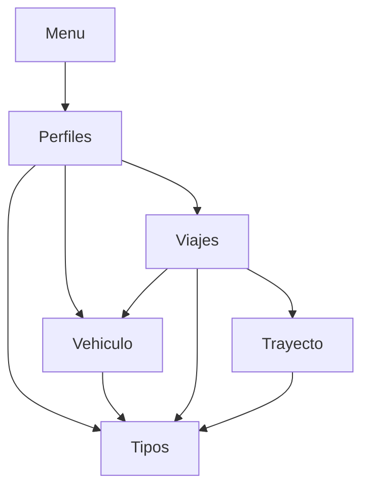
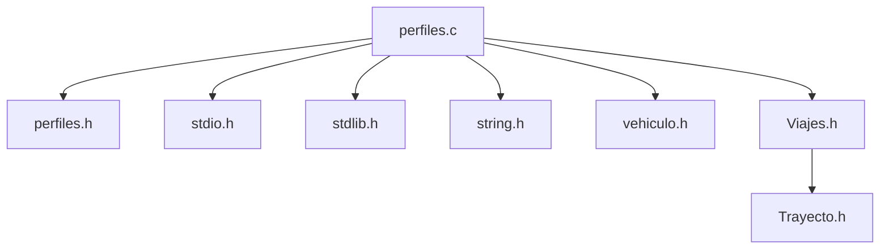
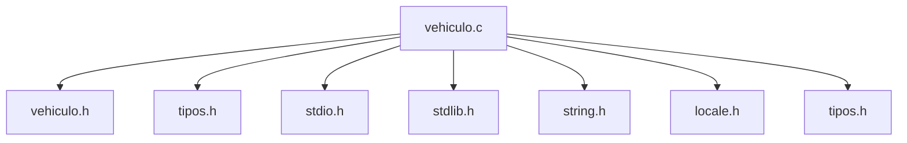
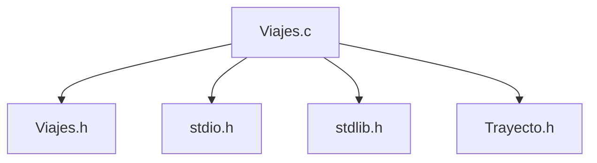
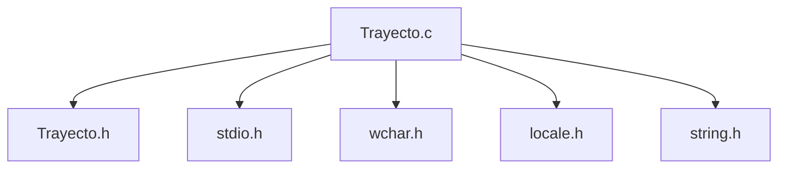
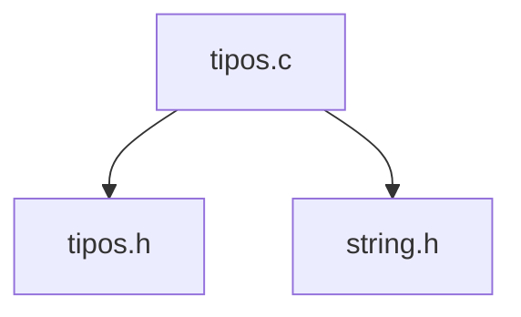
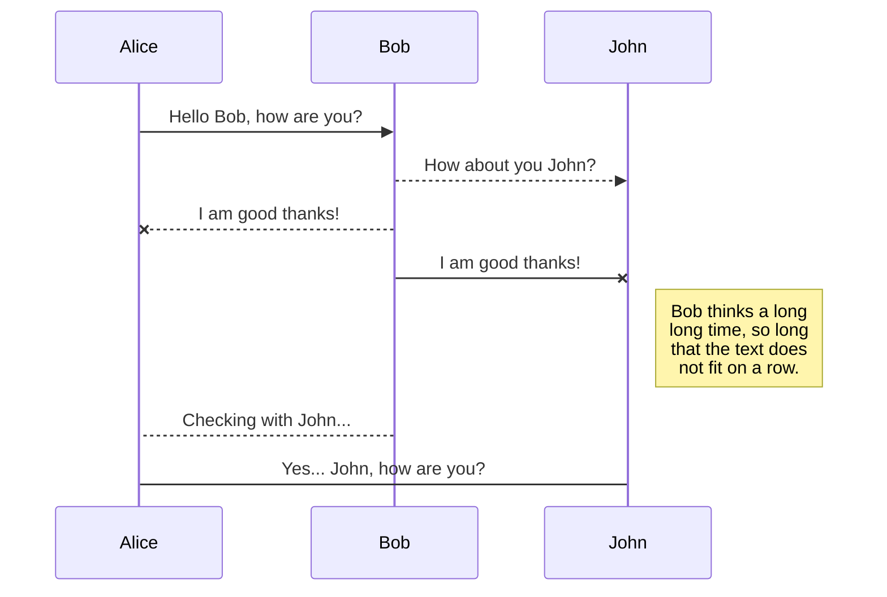
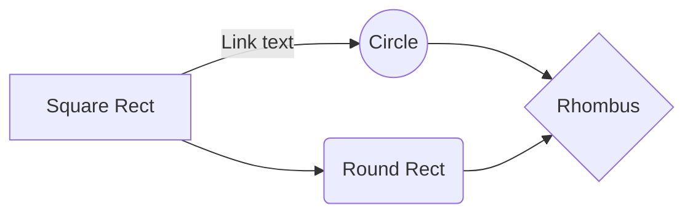

# | **ESI-Share**

## _**Metodología de la Programación**_

_1º Grado en Ingeniería Informática_


*Juan Manuel Caucelo Rodríguez*

*Jose Bello González*

*Pablo Rivero Galvín*

*Santiago Sánchez Loureiro*

***


## **| Vista General de Contenidos**

[TOC]

### 1. **Objeto del Proyecto**

***

Proyecto de la asignatura de Metodología de la Programación de la Universidad de Cádiz. 1º curso del Grado en Ingeniería Informática.

El grupo compuesto por los integrantes mencionados en la portada del proyecto se compremete al desarrollo de un programa en C capaz de permitir viajes a la Escuela Superior de Ingeniería en vehículos compartidos. Objetivos fundamentales:

* Aprender a realizar una descomposición adecuada del problema en distintos módulos, maximizando la cohesión y minimizando el acoplamiento. 
* Aprender a resolver problemas descomponiéndolos en diferentes módulos (ficheros) y realizar compilación separada. 
* Aprender a documentar programas. 
* Realizar el desarrollo de un programa trabajando en equipo de manera organizada.

### 2. **Documentación de Usuario**

***

#### 2.1 **Descripción Funcional**

Tal y como se ha comentado anteriormente, ESI-Share busca ofrecer un servicio de transporte útil a la comunidad universitaria que conforma la Escuela Superior de Ingeniería de la Universidad de Cádiz.

A través de una interfaz simple dependiente de teclado se permite al usuario manejar las distintas funcionalidades que ofrece ESI-Share. El usuario podrá ofrecer o pedir plaza en algún vehículo acompañado del importe correspondiente en la fecha y horas deseadas, incluyendo herramientas de moderación y administración de usuario para facilitar la gestión de la aplicación.

La aplicación incluye herramientas capaces de facilitar la tarea de gestión y administración, es decir, herramientas de moderación. Así, se hace uso de un sistema de identificación de usuario que distingue entre dos categorías de usuario:

* **Usuario** propiamente dicho - Dispone de funcionalidades de apertura de viajes de ida y/o vuelta a la ESI, así como una cómoda interfaz que facilita la administración de los viajes disponibles y vehículos de los que dispone el usuario.
* **Administrador** - Cuenta con herramientas de gestión de usuario, vehículo y viaje que permiten mantener un entorno funcional y útil en la aplicación.

#### 2.2 **Tecnología**

 Las herramientas utilizadas en el desarrollo de la aplicación (tanto de programación como de documentación) son las siguientes:

1. [CodeBlocks](https://sourceforge.net/projects/codeblocks/), para la generación de código.
2. [Dev C++](https://sourceforge.net/projects/orwelldevcpp/), para la generación de código.
3. [Typora](https://typora.io), para la generación de documentación.

#### 2.3 **Manual de Instalación**

ESI-Share puede ser descargado por cualquier persona con conexión a internet y acceso a un navegador convencionar (ej. Google Chrome, Opera y sus variantes, Brave, etc...), de manera que puede descargarse gratuitamente desde nuestro repositorio en [GitHub](https://github.com/prvgal/ESI-SHARE). 

ESI-Share cuenta con exigencias mínimas de prestaciones de equipo, de manera que prácticamente cualquier equipo con los componentes básicos de un ordenador (todos ellos funcionales) será capaz de ejecutar la aplicación de forma fluida e ininterrumpida.

#### 2.4 **Acceso al Sistema**

El acceso a ESI-Share es realizado a través de una ventana de Log-In similar a muchas otras aplicaciones. El usuario deberá introducir un usuario y contraseña adecuados. 

​		*Menú de Log-In*

> ​				ESI-Share
>
> Usuario:
>
> Contraseña:

Cuando este no es capaz de hacer log-in, cuenta con varias opciones:

* Registrarse - Crear una nueva cuenta, si no tiene.
* Restablecer su contraseña -  Por precaución, un miembro de la administración de la aplicación revisará el cambio de contraseña para evitar robos de cuenta.

​		 *Menú de opciones de acceso*

> ¿No tiene una cuenta o ha olvidado su contrasena?
>
> <1> Para seguir con el Inicio de Sesion.
>
> <2> Para Registrarse.
>
> <3> Para restablecer la contraseña.
>
> <0> Para cerrar ESI-SHARE.

  Para salir del sistema no hace falta más que volver al menú de inicio y elegir la opción de salida.

​		*Menú de Inicio*

> ​			MENU
>
> ​		OPCIONES
>
> <1> Perfil
>
> <2> Vehículos
>
> <3> Viajes
>
> <0> Cerrar ESI-Share

En caso de que el usuario se encuentre en otro menú, deberá marcar la opción de "Volver" hasta regresar al menú anterior.

El procedimiento seguido por el administrador es análogo al de usuario, salvo que el menú de inicio ofrece funcionalidades distintas al usuario promedio.

*Menú de Inicio - Admin*

> ​			MENU
>
> ​		OPCIONES
>
> <1> Usuarios.
>
> <2> Vehículos.
>
> <3> Viajes.
>
> <0> Cerrar ESI-Share.

### 3. **Documentación del Sistema**

***

Documentación referida a los aspectos del análisis, diseño, implementación y prueba del software, así como la implantación del mismo. Esta sección está orientada a los programadores encargados del mantenimiento del sistema. 

#### 3.1 **Especificación del Sistema**

La estructura modular seguida en el desarrollo de ESI-Share queda representada por el siguiente diagrama.

---

Diseño Modular

---



*Nota: La flecha significa que el primero utiliza elementos del segundo*

##### 3.1.1 **Módulos**

###### I. **Menu**

***

*Gráfico de dependencias*

````mermaid
graph TD
A[menu.c] --> B[perfiles.h]
A --> C[stdio.h]
````

***


###### II. **Perfiles**

***

*Gráfico de dependencias*



*Nota: Recordamos que todos los módulos principales utilizan funciones multiusos de tipos.h*

***


###### III. **Vehiculo**

***

*Gráfico de dependencias*



*Nota: Recordamos que todos los módulos principales utilizan funciones multiusos de tipos.h*

***


###### IV. **Viajes**

***

*Gráfico de dependencias*



*Nota: Recordamos que todos los módulos principales utilizan funciones multiusos de tipos.h*

***


###### V. **Trayecto**

***

*Gráfico de dependencias*



*Nota: Recordamos que todos los módulos principales utilizan funciones multiusos de tipos.h*

***


###### VI. **Tipos**

***

*Gráfico de dependencias*



*Nota: Recordamos que todos los módulos principales utilizan funciones multiusos de tipos.h*

***


  


  


## SmartyPants

SmartyPants converts ASCII punctuation characters into "smart" typographic punctuation HTML entities. For example:

|                  | ASCII                           | HTML                          |
| ---------------- | ------------------------------- | ----------------------------- |
| Single backticks | `'Isn't this fun?'`             | 'Isn't this fun?'             |
| Quotes           | `"Isn't this fun?"`             | "Isn't this fun?"             |
| Dashes           | `-- is en-dash, --- is em-dash` | -- is en-dash, --- is em-dash |


## KaTeX

You can render LaTeX mathematical expressions using [KaTeX](https://khan.github.io/KaTeX/):

The *Gamma function* satisfying $\Gamma(n) = (n-1)!\quad\forall n\in\mathbb N$ is via the Euler integral

$$
\Gamma(z) = \int_0^\infty t^{z-1}e^{-t}dt\,.
$$

> You can find more information about **LaTeX** mathematical expressions [here](http://meta.math.stackexchange.com/questions/5020/mathjax-basic-tutorial-and-quick-reference).


## UML diagrams

You can render UML diagrams using [Mermaid](https://mermaidjs.github.io/). For example, this will produce a sequence diagram:



And this will produce a flow chart:

